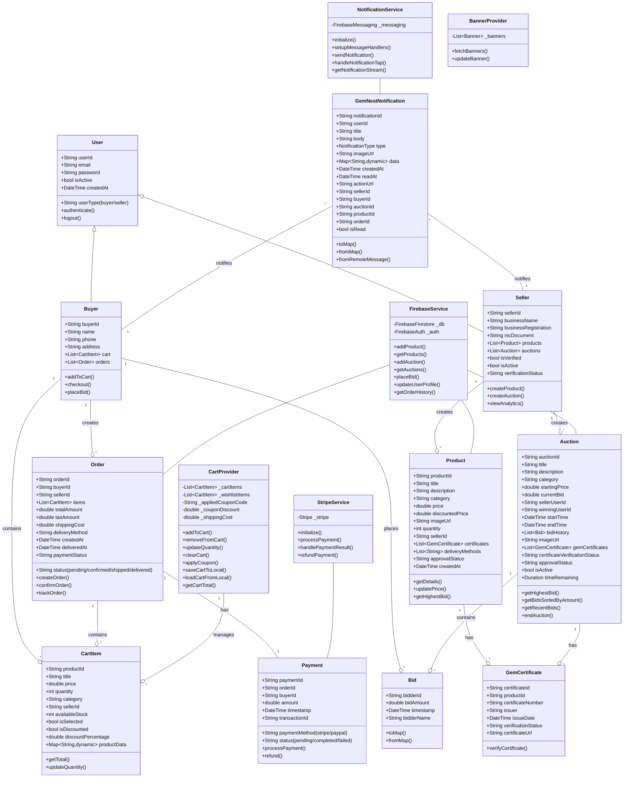
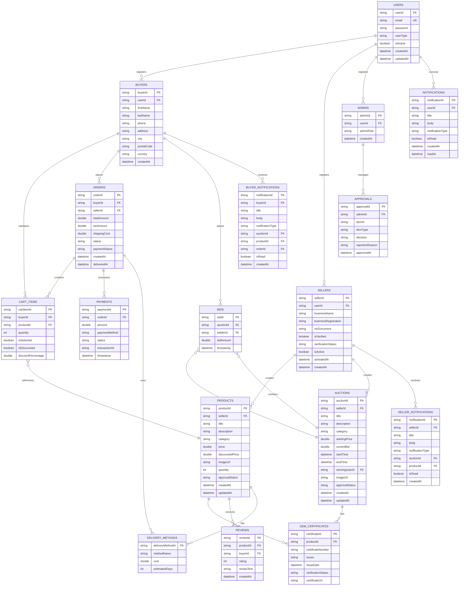

# GemNest Mobile App - Complete Mermaid Diagrams

## 1. CLASS DIAGRAM



---

## 2. ACTIVITY DIAGRAM

```mermaid
activity
    title GemNest Mobile App - Main User Flows

    start
    fork
        :User Signup/Login;
        if (User Type?) then
            :Is Buyer;
            :Access Buyer Dashboard;
            fork
                :Browse Products;
                :View Product Details;
                :Add to Cart;
                :Proceed to Checkout;
                :Process Payment with Stripe;
                :Create Order;
                :Receive Order Confirmation;
                :Track Delivery;
            and
                :Browse Auctions;
                :View Auction Details;
                :Place Bid;
                :Monitor Auction;
                if (Win Auction?) then
                    :Win Notification;
                    :Complete Payment;
                else
                    :Outbid Notification;
                endif
            and
                :View Notifications;
                :Check Order History;
                :Manage Profile;
            endfork
        else (Is Seller)
            :Access Seller Dashboard;
            fork
                :Create Product Listing;
                :Upload Product Image;
                :Fill Product Details;
                :Add Gem Certificates;
                :Submit for Approval;
                :Wait for Admin Review;
                if (Approved?) then
                    :Product Listed;
                    :Monitor Sales;
                else
                    :Approval Rejected;
                    :View Rejection Reason;
                endif
            and
                :Create Auction;
                :Set Auction Details;
                :Set Start/End Time;
                :Submit for Approval;
                :Monitor Bids;
                if (Auction Ends?) then
                    :Mark Winner;
                    :Process Payment;
                else
                    :View Active Bids;
                endif
            and
                :View Seller Analytics;
                :Manage Orders;
                :Handle Customer Messages;
            endfork
        endif
    and
        :Admin Login;
        :Access Admin Dashboard;
        fork
            :Review Pending Products;
            :Approve/Reject Products;
            :Record Decision;
        and
            :Review Pending Auctions;
            :Approve/Reject Auctions;
            :Record Decision;
        and
            :Manage Users;
            :Verify Sellers;
            :Activate/Deactivate Accounts;
        and
            :View Analytics;
            :Monitor Platform Stats;
        endfork
    endfork

    :Send Notifications;
    :Update Database;
    end

```

---

## 3. ACTIVITY DIAGRAM - PRODUCT PURCHASE FLOW

```mermaid
activity
    title Product Purchase & Order Management Flow

    start
    :Buyer Views Home Screen;
    :Browse 4 Popular Gems;
    :Select Product;
    :View Product Details Screen;
    
    fork
        :View Full Product Info;
        :View Images & Certificates;
        :Check Seller Info;
    and
        :Contact Seller Options;
        fork
            :Call Seller;
        or
            :Message via WhatsApp;
        endfork
    and
        :Add to Cart Actions;
        :Select Quantity;
        :Add Item to Cart;
    endfork
    
    :Proceed to Cart;
    :View Cart Items;
    :Apply Coupon (Optional);
    :Review Order Summary;
    :Confirm Order;
    :Proceed to Checkout;
    :Enter Shipping Address;
    :Select Delivery Method;
    :Process Payment via Stripe;
    
    if (Payment Successful?) then
        :Payment Confirmed;
        :Create Order Record;
        :Save Order to Firestore;
        :Send Order Confirmation;
        :Notify Seller;
        :Clear Cart;
        :Show Order Success Screen;
    else
        :Payment Failed;
        :Show Error Message;
        :Retry Payment Option;
    endif
    
    :Order Created;
    :Seller Prepares Order;
    :Update Order Status to Shipped;
    :Send Shipping Notification;
    :Buyer Receives Tracking Info;
    :Package Delivered;
    :Update Order Status to Delivered;
    :Send Delivery Notification;
    :Order Complete;
    end

```

---

## 4. ACTIVITY DIAGRAM - AUCTION FLOW

```mermaid
activity
    title Auction Lifecycle & Bidding Flow

    start
    :Seller Creates Auction;
    :Fill Auction Details;
    :Set Starting Price;
    :Set End Time;
    :Upload Auction Image;
    :Submit for Approval;
    
    if (Admin Approves?) then
        :Auction Listed;
        :Set Status: Active;
    else
        :Auction Rejected;
        :Notify Seller;
        :End Process;
    endif
    
    :Auction Goes Live;
    :Display Countdown Timer;
    :Show Current Bid;
    :Show Bidding History;
    
    fork
        :Buyer Views Auction;
        :View Auction Details;
        :Check Bid History;
        :Monitor Time Remaining;
    and
        repeat
            :Buyer Places Bid;
            :Validate Bid Amount;
            if (Bid Valid?) then
                :Update Current Bid;
                :Add to Bid History;
                :Notify Previous Bidder;
            else
                :Show Validation Error;
            endif
        repeat
    endfork
    
    :Auction End Time Reached;
    :Close Bidding;
    :Determine Winner;
    :Notify Winning Bidder;
    
    if (Winner Confirms?) then
        :Create Order;
        :Process Payment;
        if (Payment Successful?) then
            :Mark Auction Won;
            :Notify Seller;
            :Initiate Shipping;
        else
            :Payment Failed;
            :Contact Winning Bidder;
        endif
    else
        :Cancel Transaction;
    endif
    
    :Auction Complete;
    end

```

---

## 5. ACTIVITY DIAGRAM - NOTIFICATION FLOW

```mermaid
activity
    title Push Notification & Approval System

    start
    fork
        :Product/Auction Approval Flow;
        :Seller Submits Item;
        :Item Status: Pending;
        :Admin Reviews Item;
        
        if (Admin Decision?) then (Approved)
            :Update Approval Status;
            :Send Approval Notification;
            :List Item Publicly;
        else (Rejected)
            :Update Status: Rejected;
            :Send Rejection Notification;
            :Include Rejection Reason;
        endif
    and
        :Auction Activity Notifications;
        :Bid Placed;
        fork
            :Notify Previous Bidder: Outbid;
        and
            :Notify Seller: New Bid;
        endfork
        :Auction Ending Soon;
        :Notify Active Bidders;
    and
        :Order Status Notifications;
        :Order Confirmed;
        :Notify Buyer & Seller;
        :Order Shipped;
        :Notify Buyer with Tracking;
        :Order Delivered;
        :Notify Buyer;
    and
        :Payment Notifications;
        :Payment Received;
        :Send Receipt;
        :Payment Failed;
        :Send Retry Instructions;
    endfork
    
    :Notification Service;
    :Prepare Notification Object;
    :Send via Firebase Cloud Messaging;
    :Store in Firestore;
    :Display in App Notification Center;
    :User Receives Notification;
    
    if (User Taps Notification?) then
        :Navigate to Relevant Screen;
        :Show Details;
    else
        :Mark as Read;
    endif
    
    end

```

---

## 6. ER DIAGRAM (Entity Relationship Diagram)



---

## Diagram Summary

### 📊 Class Diagram
Shows all core classes and their relationships:
- **User Types**: User, Buyer, Seller
- **Marketplace Entities**: Product, Auction, Bid
- **Transaction Management**: Order, Payment, CartItem
- **System Services**: NotificationService, FirebaseService, StripeService
- **Data Models**: GemNestNotification, GemCertificate

### 🔄 Activity Diagrams
1. **Main User Flows**: Buyer, Seller, and Admin workflows
2. **Product Purchase**: Complete shopping flow from browsing to delivery
3. **Auction Flow**: Auction creation, bidding, and completion
4. **Notification System**: Approval, order, and activity notifications

### 💾 ER Diagram
Complete database schema showing:
- **User Management**: Users, Buyers, Sellers, Admins
- **Product Management**: Products, Auctions, GemCertificates
- **Transaction Management**: Orders, Payments, Carts
- **Activity Tracking**: Bids, Reviews, Notifications
- **System Data**: DeliveryMethods, Approvals

All diagrams are production-ready and represent the complete GemNest Mobile App architecture!
