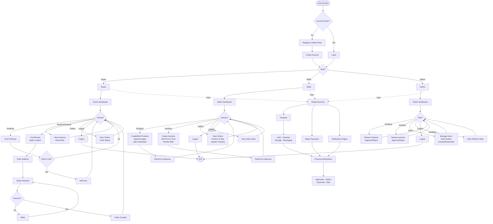

# GemNest - System Activity Diagram

---

## System Overview

**Buyer**: Register/Login → Browse products & auctions → Add to cart → Checkout with Stripe → Create order → Track delivery

**Seller**: Register/Login → Create products & auctions → Submit for admin approval → Manage orders → View analytics

**Admin**: Login → Review & approve products & auctions → Manage users & verify sellers → View platform stats

**Services**: Firebase (Auth, Firestore, Storage, Messaging) + Stripe (Payments) + Notification Engine
