# GemNest - Simple Complete System Activity Diagram

```mermaid
flowchart TD
    Start([🚀 User Accesses GemNest])
    Start --> Auth{Account Exists?}
    
    Auth -->|No| Signup[📝 Register<br/>Select Role<br/>Upload Documents]
    Auth -->|Yes| Login[🔐 Login]
    
    Signup --> CreateAcc[✅ Create Account]
    CreateAcc --> VerifyRole{Verify Role}
    Login --> VerifyRole
    
    VerifyRole -->|Buyer| BuyerFlow[👤 BUYER]
    VerifyRole -->|Seller| SellerFlow[🏪 SELLER]
    VerifyRole -->|Admin| AdminFlow[⚙️ ADMIN]
    
    %% ========== BUYER FLOW ==========
    BuyerFlow --> BuyerMenu{Buyer<br/>Action?}
    
    BuyerMenu -->|Browse Products| ProductBrowse[📸 View Products<br/>See Details]
    ProductBrowse --> ContactChoice{Contact<br/>Seller?}
    ContactChoice -->|Yes| Contact[☎️ Call or 💬 WhatsApp]
    ContactChoice -->|No| AddCart{Add to<br/>Cart?}
    Contact --> AddCart
    AddCart -->|Yes| CartAdd[➕ Add & Save]
    AddCart -->|No| BuyerMenu
    CartAdd --> BuyerMenu
    
    BuyerMenu -->|Browse Auctions| AuctionBrowse[🏆 View Auctions]
    AuctionBrowse --> PlaceBid{Place<br/>Bid?}
    PlaceBid -->|Yes| ValidateBid{Bid<br/>Valid?}
    ValidateBid -->|No| BidError[❌ Min Bid Required]
    ValidateBid -->|Yes| BidSuccess[✅ Bid Placed]
    BidError --> PlaceBid
    BidSuccess --> NotifyOld[📲 Notify Outbid]
    NotifyOld --> BuyerMenu
    PlaceBid -->|No| BuyerMenu
    
    BuyerMenu -->|View Cart| CartView[🛒 Cart Items<br/>Adjust Qty]
    CartView --> Coupon{Apply<br/>Coupon?}
    Coupon -->|Yes| ValidateCoup{Valid?}
    ValidateCoup -->|Yes| DiscApply[💵 Discount Applied]
    ValidateCoup -->|No| NoDisc[❌ Invalid]
    NoDisc --> Coupon
    Coupon -->|No| CalcTotal[🧮 Calculate Total]
    DiscApply --> CalcTotal
    CalcTotal --> Checkout{Checkout?}
    Checkout -->|Yes| Address[📍 Enter Address]
    Checkout -->|No| BuyerMenu
    Address --> Delivery[🚚 Select Delivery]
    Delivery --> Review[👁️ Review Order]
    Review --> Payment[💳 Stripe Payment]
    Payment --> PayCheck{Success?}
    PayCheck -->|No| Retry{Retry?}
    Retry -->|Yes| Payment
    Retry -->|No| BuyerMenu
    PayCheck -->|Yes| CreateOrder[📦 Create Order]
    CreateOrder --> SaveDB[💾 Save to DB]
    SaveDB --> NotifyBuyer[✉️ Confirmation]
    NotifyBuyer --> NotifySeller[📲 Notify Seller]
    NotifySeller --> BuyerMenu
    
    BuyerMenu -->|Order History| OrderView[📜 View Orders<br/>Track Status]
    OrderView --> BuyerMenu
    
    BuyerMenu -->|Notifications| NotifView[🔔 View Notifications<br/>Mark as Read]
    NotifView --> BuyerMenu
    
    BuyerMenu -->|Profile| ProfileView[👤 Edit Profile]
    ProfileView --> BuyerMenu
    
    BuyerMenu -->|Logout| LogoutBuyer[🚪 Logout]
    LogoutBuyer --> End1([🏁 End Session])
    
    %% ========== SELLER FLOW ==========
    SellerFlow --> SellerMenu{Seller<br/>Action?}
    
    SellerMenu -->|Manage Products| ViewProd[📦 View My Products]
    ViewProd --> ProdAction{Action?}
    ProdAction -->|Create| AddProd[✏️ Fill Form<br/>Upload Image<br/>Add Certificates]
    ProdAction -->|Edit| EditProd[✏️ Update Details]
    AddProd --> SubmitProd[📤 Submit for Approval]
    EditProd --> SellerMenu
    SubmitProd --> PendStatus[⏳ Status: Pending]
    PendStatus --> SellerMenu
    
    SellerMenu -->|Manage Auctions| ViewAuc[🏆 View My Auctions]
    ViewAuc --> AucAction{Action?}
    AucAction -->|Create| AddAuc[✏️ Fill Form<br/>Set Time & Price<br/>Add Certificates]
    AucAction -->|Monitor| MonitorBid[👁️ Monitor Bids<br/>View Bidders<br/>Timer]
    AddAuc --> SubmitAuc[📤 Submit for Approval]
    MonitorBid --> SellerMenu
    SubmitAuc --> AucPending[⏳ Status: Pending]
    AucPending --> SellerMenu
    
    SellerMenu -->|Manage Orders| ViewOrd[📦 View Orders]
    ViewOrd --> OrdStatus{Order<br/>Status?}
    OrdStatus -->|Pending| Confirm[✅ Confirm Order]
    OrdStatus -->|Confirmed| Ship[📤 Prepare & Ship<br/>Enter Tracking]
    OrdStatus -->|Shipped| Track[🗺️ Delivery Update]
    Confirm --> SellerMenu
    Ship --> NotifyShip[📲 Notify Buyer]
    Track --> SellerMenu
    NotifyShip --> SellerMenu
    
    SellerMenu -->|Analytics| Analytics[📊 View:<br/>Sales • Products<br/>Auctions • Revenue]
    Analytics --> SellerMenu
    
    SellerMenu -->|Notifications| SellerNotif[🔔 View Notifications<br/>Approvals • Orders<br/>Bids]
    SellerNotif --> SellerMenu
    
    SellerMenu -->|Logout| LogoutSeller[🚪 Logout]
    LogoutSeller --> End2([🏁 End Session])
    
    %% ========== ADMIN FLOW ==========
    AdminFlow --> AdminMenu{Admin<br/>Action?}
    
    AdminMenu -->|Approve Products| ApproveProd[📦 Review Products]
    ApproveProd --> ProdDecide{Approve?}
    ProdDecide -->|Yes| ApproveY[✅ Approved<br/>Go Live]
    ProdDecide -->|No| RejectY[❌ Rejected<br/>Send Reason]
    ApproveY --> NotifyAdminP[📲 Notify Seller]
    RejectY --> NotifyAdminP
    NotifyAdminP --> AdminMenu
    
    AdminMenu -->|Approve Auctions| ApproveAuc[🏆 Review Auctions]
    ApproveAuc --> AucDecide{Approve?}
    AucDecide -->|Yes| ApproveYA[✅ Approved<br/>Go Live]
    AucDecide -->|No| RejectYA[❌ Rejected]
    ApproveYA --> NotifyAdminA[📲 Notify Seller]
    RejectYA --> NotifyAdminA
    NotifyAdminA --> AdminMenu
    
    AdminMenu -->|Manage Users| ManageUsers[👥 View All Users]
    ManageUsers --> UserFilter{Type?}
    UserFilter -->|Buyers| BuyerList[👤 Buyers]
    UserFilter -->|Sellers| SellerList[🏪 Sellers]
    BuyerList --> UserAction{Action?}
    SellerList --> UserAction
    UserAction -->|Verify| Verify[✔️ Verify Seller]
    UserAction -->|Activate| Activate[✅ Activate]
    UserAction -->|Deactivate| Deactivate[❌ Deactivate]
    Verify --> UpdateUser[🔄 Update Status]
    Activate --> UpdateUser
    Deactivate --> UpdateUser
    UpdateUser --> AdminMenu
    
    AdminMenu -->|View Analytics| ViewStats[📊 Platform Stats:<br/>Users • Products<br/>Auctions • Revenue<br/>Orders • Active]
    ViewStats --> AdminMenu
    
    AdminMenu -->|Moderation| Moderate[🛡️ Review Reports<br/>Take Action]
    Moderate --> AdminMenu
    
    AdminMenu -->|Logout| LogoutAdmin[🚪 Logout]
    LogoutAdmin --> End3([🏁 End Session])
    
    %% ========== GLOBAL SERVICES ==========
    BuyerFlow -.->|Uses| Services[🔧 Global Services]
    SellerFlow -.->|Uses| Services
    AdminFlow -.->|Uses| Services
    
    Services --> Firebase[🔥 Firebase]
    Firebase --> Auth[🔐 Auth]
    Firebase --> Firestore[💾 Firestore]
    Firebase --> Storage[📦 Storage]
    Firebase --> FCM[📨 Messaging]
    
    Services --> Stripe[💳 Stripe]
    Services --> Notif[🔔 Notifications]
    
    Stripe --> PayProcess[💰 Process<br/>Payments]
    Notif --> TrigNotif[📤 Send<br/>Notifications]
    
    PayProcess --> NotifEngine[🚀 Notification Engine]
    TrigNotif --> NotifEngine
    
    NotifEngine --> NotifTypes[📬 Types:<br/>✉️ Approvals<br/>✉️ Bids/Outbid<br/>✉️ Orders<br/>✉️ Shipping<br/>✉️ Payments]
```



```

---

## 📊 Simplified System Activity Overview

This streamlined diagram includes **all major activities** while maintaining clarity:

### 🔐 **Authentication**
- User login/registration
- Role selection (Buyer/Seller/Admin)
- Document upload for sellers

### 👥 **Buyer Activities**
- 📸 Browse & view products
- ☎️💬 Contact sellers (call/WhatsApp)
- 🛒 Add items to cart
- 🏆 Place auctions bids
- 🎟️ Apply coupon codes
- 💳 Checkout via Stripe
- 📦 Track orders
- 🔔 View notifications

### 🏪 **Seller Activities**
- 📦 Create/edit products
- 🏆 Create/monitor auctions
- 📤 Submit items for approval
- 📜 Manage orders (confirm/ship)
- 📊 View analytics
- 🔔 Receive notifications

### ⚙️ **Admin Activities**
- ✅ Approve/reject products
- ✅ Approve/reject auctions
- 👥 Manage & verify users
- 📊 View platform analytics
- 🛡️ Handle moderation

### 🔧 **Global Services**
- 🔥 **Firebase**: Authentication, Firestore, Storage, Cloud Messaging
- 💳 **Stripe**: Payment processing
- 🔔 **Notifications**: Multi-channel notification engine
