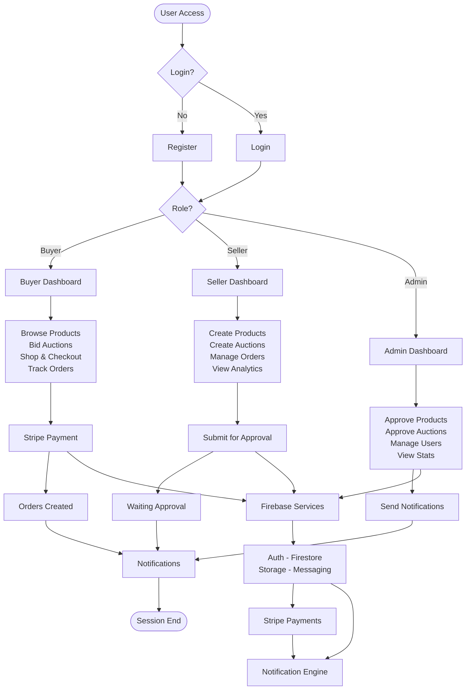

# GemNest - System Activity Diagram

---

## System Overview

**Buyer**: Browse products → Bid auctions → Shop → Payment → Track orders

**Seller**: Create products → Create auctions → Submit approval → Manage orders

**Admin**: Approve items → Manage users → View stats

**Services**: Firebase (Auth, Firestore, Storage, Messaging) + Stripe + Notifications
