# GemNest - Simple System Activity Diagram

```mermaid
flowchart TD
    Start([User Access])
    Start --> Auth{Account Exists?}
    
    Auth -->|No| Signup[Register<br/>Select Role]
    Auth -->|Yes| Login[Login]
    
    Signup --> CreateAcc[Create Account]
    CreateAcc --> VerifyRole{Verify Role}
    Login --> VerifyRole
    
    VerifyRole -->|Buyer| BuyerFlow[BUYER]
    VerifyRole -->|Seller| SellerFlow[SELLER]
    VerifyRole -->|Admin| AdminFlow[ADMIN]
    
    %% BUYER
    BuyerFlow --> BuyerMenu{Action?}
    
    BuyerMenu -->|Products| BrowseProd[View Products]
    BrowseProd --> ContactSeller{Contact?}
    ContactSeller -->|Yes| Contact[Call/WhatsApp]
    ContactSeller -->|No| AddCart1{Add Cart?}
    Contact --> AddCart1
    AddCart1 -->|Yes| CartAdd[Add to Cart]
    AddCart1 -->|No| BuyerMenu
    CartAdd --> BuyerMenu
    
    BuyerMenu -->|Auctions| BrowseAuc[View Auctions]
    BrowseAuc --> PlaceBid{Place Bid?}
    PlaceBid -->|Yes| ValidateBid{Valid?}
    ValidateBid -->|No| BidError[Error]
    ValidateBid -->|Yes| BidSuccess[Bid Placed]
    BidError --> PlaceBid
    BidSuccess --> NotifyOld[Notify Outbid]
    NotifyOld --> BuyerMenu
    PlaceBid -->|No| BuyerMenu
    
    BuyerMenu -->|Cart| ViewCart[View Cart]
    ViewCart --> Coupon{Coupon?}
    Coupon -->|Yes| ValidateCoup{Valid?}
    ValidateCoup -->|Yes| DiscApply[Discount Applied]
    ValidateCoup -->|No| NoDisc[Invalid]
    NoDisc --> Coupon
    Coupon -->|No| CalcTotal[Calculate Total]
    DiscApply --> CalcTotal
    CalcTotal --> Checkout{Checkout?}
    Checkout -->|Yes| Address[Enter Address]
    Checkout -->|No| BuyerMenu
    Address --> Delivery[Select Delivery]
    Delivery --> Review[Review Order]
    Review --> Payment[Process Payment]
    Payment --> PayCheck{Success?}
    PayCheck -->|No| Retry{Retry?}
    Retry -->|Yes| Payment
    Retry -->|No| BuyerMenu
    PayCheck -->|Yes| CreateOrder[Create Order]
    CreateOrder --> SaveDB[Save to DB]
    SaveDB --> NotifyBuyer[Send Confirmation]
    NotifyBuyer --> NotifySeller[Notify Seller]
    NotifySeller --> BuyerMenu
    
    BuyerMenu -->|Orders| OrderView[View Orders]
    OrderView --> BuyerMenu
    
    BuyerMenu -->|Notifications| NotifView[View Notifications]
    NotifView --> BuyerMenu
    
    BuyerMenu -->|Profile| ProfileView[Edit Profile]
    ProfileView --> BuyerMenu
    
    BuyerMenu -->|Logout| LogoutBuyer[Logout]
    LogoutBuyer --> End1([End])
    
    %% SELLER
    SellerFlow --> SellerMenu{Action?}
    
    SellerMenu -->|Products| ViewProd[View Products]
    ViewProd --> ProdAction{Create/Edit?}
    ProdAction -->|Create| AddProd[Fill Form<br/>Upload Image]
    ProdAction -->|Edit| EditProd[Update Details]
    AddProd --> SubmitProd[Submit]
    EditProd --> SellerMenu
    SubmitProd --> PendStatus[Status: Pending]
    PendStatus --> SellerMenu
    
    SellerMenu -->|Auctions| ViewAuc[View Auctions]
    ViewAuc --> AucAction{Create/Monitor?}
    AucAction -->|Create| AddAuc[Fill Form<br/>Set Time & Price]
    AucAction -->|Monitor| MonitorBid[Monitor Bids]
    AddAuc --> SubmitAuc[Submit]
    MonitorBid --> SellerMenu
    SubmitAuc --> AucPending[Status: Pending]
    AucPending --> SellerMenu
    
    SellerMenu -->|Orders| ViewOrd[View Orders]
    ViewOrd --> OrdStatus{Status?}
    OrdStatus -->|Pending| Confirm[Confirm]
    OrdStatus -->|Confirmed| Ship[Prepare & Ship]
    OrdStatus -->|Shipped| Track[Update Delivery]
    Confirm --> SellerMenu
    Ship --> NotifyShip[Notify Buyer]
    Track --> SellerMenu
    NotifyShip --> SellerMenu
    
    SellerMenu -->|Analytics| Analytics[View Analytics]
    Analytics --> SellerMenu
    
    SellerMenu -->|Notifications| SellerNotif[View Notifications]
    SellerNotif --> SellerMenu
    
    SellerMenu -->|Logout| LogoutSeller[Logout]
    LogoutSeller --> End2([End])
    
    %% ADMIN
    AdminFlow --> AdminMenu{Action?}
    
    AdminMenu -->|Products| ApproveProd[Review Products]
    ApproveProd --> ProdDecide{Approve?}
    ProdDecide -->|Yes| ApproveY[Approved]
    ProdDecide -->|No| RejectY[Rejected]
    ApproveY --> NotifyAdminP[Notify Seller]
    RejectY --> NotifyAdminP
    NotifyAdminP --> AdminMenu
    
    AdminMenu -->|Auctions| ApproveAuc[Review Auctions]
    ApproveAuc --> AucDecide{Approve?}
    AucDecide -->|Yes| ApproveYA[Approved]
    AucDecide -->|No| RejectYA[Rejected]
    ApproveYA --> NotifyAdminA[Notify Seller]
    RejectYA --> NotifyAdminA
    NotifyAdminA --> AdminMenu
    
    AdminMenu -->|Users| ManageUsers[View Users]
    ManageUsers --> UserFilter{Type?}
    UserFilter -->|Buyers| BuyerList[Buyers]
    UserFilter -->|Sellers| SellerList[Sellers]
    BuyerList --> UserAction{Action?}
    SellerList --> UserAction
    UserAction -->|Verify| Verify[Verify]
    UserAction -->|Activate| Activate[Activate]
    UserAction -->|Deactivate| Deactivate[Deactivate]
    Verify --> UpdateUser[Update Status]
    Activate --> UpdateUser
    Deactivate --> UpdateUser
    UpdateUser --> AdminMenu
    
    AdminMenu -->|Analytics| ViewStats[View Stats]
    ViewStats --> AdminMenu
    
    AdminMenu -->|Moderation| Moderate[Review Reports]
    Moderate --> AdminMenu
    
    AdminMenu -->|Logout| LogoutAdmin[Logout]
    LogoutAdmin --> End3([End])
    
    %% SERVICES
    BuyerFlow -.->|Uses| Services[Global Services]
    SellerFlow -.->|Uses| Services
    AdminFlow -.->|Uses| Services
    
    Services --> Firebase[Firebase]
    Firebase --> Auth[Auth]
    Firebase --> Firestore[Firestore]
    Firebase --> Storage[Storage]
    Firebase --> FCM[Messaging]
    
    Services --> Stripe[Stripe]
    Services --> Notif[Notifications]
    
    Stripe --> PayProcess[Process Payments]
    Notif --> TrigNotif[Send Notifications]
    
    PayProcess --> NotifEngine[Notification Engine]
    TrigNotif --> NotifEngine
    
    NotifEngine --> NotifTypes[Notification Types]
```

---

## System Activity Overview

### Authentication
- User login/registration
- Role verification (Buyer/Seller/Admin)

### Buyer Activities
- Browse and view products
- Contact sellers (call/WhatsApp)
- Browse and bid on auctions
- Manage shopping cart
- Apply coupon codes
- Checkout and payment
- Track orders
- View notifications

### Seller Activities
- Create and edit products
- Create and monitor auctions
- Submit items for approval
- Manage orders (confirm/ship)
- View analytics
- Receive notifications

### Admin Activities
- Review and approve products
- Review and approve auctions
- Manage user accounts
- Verify sellers
- View platform analytics
- Handle moderation

### Global Services
- Firebase: Authentication, Firestore, Storage, Messaging
- Stripe: Payment processing
- Notification Engine: Multi-channel notifications
