# GemNest - Complete System Activity Flowchart

```mermaid
flowchart TD
    Start([🚀 User Accesses GemNest App])
    
    Start --> Auth{User Account<br/>Exists?}
    
    Auth -->|No| Signup[📝 Create New Account]
    Auth -->|Yes| Login[🔐 Login with Credentials]
    
    Signup --> SelectRole{Select User<br/>Type}
    SelectRole -->|Buyer| BuyerSignup[Register as Buyer]
    SelectRole -->|Seller| SellerSignup[Upload Business Documents]
    
    SellerSignup --> NICDoc[📄 Upload NIC Document]
    SellerSignup --> BizReg[📄 Upload Business Registration]
    
    BizReg --> CreateAcc[✅ Create Account]
    BuyerSignup --> CreateAcc
    
    Login --> VerifyRole{Verify Role<br/>& Status}
    CreateAcc --> VerifyRole
    
    VerifyRole -->|Buyer| BuyerFlow[👤 BUYER FLOW]
    VerifyRole -->|Seller Not Verified| SellerWait[⏳ Waiting for Admin Approval]
    VerifyRole -->|Seller Verified| SellerFlow[🏪 SELLER FLOW]
    VerifyRole -->|Admin| AdminFlow[⚙️ ADMIN FLOW]
    
    %% ========== BUYER FLOW ==========
    BuyerFlow --> BuyerDash[📱 Load Buyer Dashboard]
    BuyerDash --> HomeScreen[🏠 Home Screen]
    
    HomeScreen --> LoadProducts[📦 Load 4 Popular Gems]
    LoadProducts --> LoadCart[🛒 Initialize Cart Provider]
    LoadCart --> LoadBanners[🎯 Load Promotional Banners]
    
    LoadBanners --> BuyerMenu{Buyer<br/>Action}
    
    %% Product Browsing
    BuyerMenu -->|Browse Products| ProductBrowse[👀 View Product Categories]
    ProductBrowse --> ViewProduct[📸 View Product Details]
    ViewProduct --> ProductDetails[📋 Display:<br/>• Image • Price<br/>• Description<br/>• Certificates]
    ProductDetails --> ContactSeller{Contact<br/>Seller?}
    ContactSeller -->|Call| CallSeller[☎️ Initiate Phone Call]
    ContactSeller -->|WhatsApp| WhatsappSeller[💬 Open WhatsApp Chat]
    ContactSeller -->|No| AddCart1{Add to<br/>Cart?}
    CallSeller --> AddCart1
    WhatsappSeller --> AddCart1
    AddCart1 -->|Yes| SelectQty[📊 Select Quantity]
    SelectQty --> CartAdd[➕ Add to Cart<br/>& Update Count]
    CartAdd --> BuyerMenu
    AddCart1 -->|No| BuyerMenu
    
    %% Auction Participation
    BuyerMenu -->|Browse Auctions| AuctionBrowse[🏆 View Active Auctions]
    AuctionBrowse --> AuctionDetails[📋 View Auction:<br/>• Image • Starting Price<br/>• Countdown Timer<br/>• Bid History]
    AuctionDetails --> PlaceBid{Place<br/>Bid?}
    PlaceBid -->|Yes| EnterBid[💰 Enter Bid Amount]
    EnterBid --> ValidateBid{Bid Valid?<br/>Bid >= CurrentBid<br/>+ MinIncrement}
    ValidateBid -->|No| BidError[❌ Show Error<br/>Suggest Min Bid]
    BidError --> PlaceBid
    ValidateBid -->|Yes| BidSuccess[✅ Bid Accepted]
    BidSuccess --> UpdateBid[🔄 Update Current Bid<br/>Add to History]
    UpdateBid --> NotifyOutbid[📲 Notify Previous Bidder]
    NotifyOutbid --> BuyerMenu
    PlaceBid -->|No| BuyerMenu
    
    %% Shopping Cart
    BuyerMenu -->|View Cart| CartView[🛒 Display Cart Items]
    CartView --> CartDetails[📦 Show:<br/>• Product • Price<br/>• Quantity • Subtotal]
    CartDetails --> CartAction{Cart<br/>Action}
    CartAction -->|Adjust Qty| UpdateQty[🔢 Update Quantity]
    CartAction -->|Apply Coupon| ApplyCoupon[🎟️ Enter Coupon Code]
    ApplyCoupon --> ValidateCoupon{Coupon<br/>Valid?}
    ValidateCoupon -->|Yes| CalcDiscount[💵 Calculate Discount]
    ValidateCoupon -->|No| CouponError[❌ Invalid Coupon]
    CouponError --> CartAction
    CalcDiscount --> CartAction
    UpdateQty --> CartAction
    CartAction -->|Proceed| CalcTotal[🧮 Calculate Totals:<br/>Subtotal + Tax + Shipping]
    CalcTotal --> Checkout{Proceed to<br/>Checkout?}
    
    %% Checkout & Payment
    Checkout -->|Yes| ShippingAddr[📍 Enter Shipping Address]
    Checkout -->|No| BuyerMenu
    ShippingAddr --> VerifyAddr[✔️ Verify Address]
    VerifyAddr --> SelectDelivery[🚚 Select Delivery:<br/>• Standard 5-7 days<br/>• Express 2-3 days<br/>• Same Day]
    SelectDelivery --> ReviewOrder[👁️ Review Order Summary]
    ReviewOrder --> InitStripe[💳 Initialize Stripe Payment]
    InitStripe --> PaymentForm[📝 Enter Payment Details:<br/>• Card Number<br/>• CVV • Expiry Date]
    PaymentForm --> SubmitPay[🔒 Submit Payment to Stripe]
    
    SubmitPay --> PaymentCheck{Payment<br/>Successful?}
    PaymentCheck -->|Failed| PayFailed[❌ Payment Failed]
    PayFailed --> PayRetry{Retry<br/>Payment?}
    PayRetry -->|Yes| SubmitPay
    PayRetry -->|No| SaveDraft[💾 Save as Draft]
    SaveDraft --> BuyerMenu
    
    PaymentCheck -->|Success| PaySuccess[✅ Payment Confirmed]
    PaySuccess --> CreateOrder[📦 Create Order Record]
    CreateOrder --> SaveOrderDB[💾 Save to Firestore]
    SaveOrderDB --> UpdateStock[📊 Update Product Stock]
    UpdateStock --> ClearCart[🗑️ Clear Cart]
    ClearCart --> NotifyBuyer[📧 Send Confirmation to Buyer]
    NotifyBuyer --> NotifySeller[📲 Notify Seller]
    NotifySeller --> ShowSuccess[✅ Show Success Screen<br/>Display Order Number]
    ShowSuccess --> BuyerMenu
    
    %% Order Management
    BuyerMenu -->|Order History| OrderHist[📜 View Order History]
    OrderHist --> SelectOrder[🔍 Select Order to View]
    SelectOrder --> OrderDetails[📋 Display Order:<br/>• Items • Status<br/>• Total • Date]
    OrderDetails --> TrackOrder{Track<br/>Order?}
    TrackOrder -->|Yes| Tracking[🗺️ Show Shipping Status<br/>Tracking Number<br/>Estimated Delivery]
    TrackOrder -->|No| BuyerMenu
    Tracking --> BuyerMenu
    
    %% Notifications
    BuyerMenu -->|Notifications| NotifCenter[🔔 Notification Center]
    NotifCenter --> FetchNotif[📥 Fetch All Notifications]
    FetchNotif --> FilterNotif{Filter<br/>Type}
    FilterNotif -->|Orders| OrderNotif[📦 Order Updates]
    FilterNotif -->|Auctions| AuctionNotif[🏆 Auction Alerts]
    FilterNotif -->|System| SystemNotif[⚙️ System Messages]
    OrderNotif --> ReadNotif[✔️ Mark as Read]
    AuctionNotif --> ReadNotif
    SystemNotif --> ReadNotif
    ReadNotif --> NavNotif[🔗 Navigate to Item]
    NavNotif --> BuyerMenu
    
    %% Profile
    BuyerMenu -->|Profile| Profile[👤 User Profile]
    Profile --> EditProf[✏️ Edit Profile]
    EditProf --> BuyerMenu
    
    %% ========== SELLER FLOW ==========
    SellerFlow --> SellerDash[🏪 Load Seller Dashboard]
    SellerDash --> SellerStats[📊 Display:<br/>• Total Products<br/>• Total Auctions<br/>• Total Sales<br/>• Revenue]
    
    SellerStats --> SellerMenu{Seller<br/>Action}
    
    %% Product Management
    SellerMenu -->|Manage Products| ViewProducts[📦 View My Products]
    ViewProducts --> FilterProd{Filter<br/>Status?}
    FilterProd -->|Active| ActiveProd[✅ Active Products]
    FilterProd -->|Pending| PendingProd[⏳ Pending Approval]
    FilterProd -->|Rejected| RejectedProd[❌ Rejected Products]
    
    ActiveProd --> CreateProd{Create<br/>New?}
    PendingProd --> CreateProd
    RejectedProd --> CreateProd
    
    CreateProd -->|Yes| ProdForm[📝 Product Upload Form]
    CreateProd -->|No| EditProd[✏️ Edit Existing Product]
    
    ProdForm --> ProdDetails[📋 Enter:<br/>• Title • Description<br/>• Category • Quantity]
    ProdDetails --> ProdPrice[💰 Set Price & Discount]
    ProdPrice --> ProdImage[📸 Upload Product Image]
    ProdImage --> ProdCert[📄 Add Gem Certificates]
    ProdCert --> ProdDelivery[🚚 Select Delivery Methods]
    ProdDelivery --> SubmitProd[📤 Submit for Approval]
    SubmitProd --> ProdApprovalPending[⏳ Status: Pending]
    ProdApprovalPending --> SellerMenu
    
    EditProd --> UpdatePrice[💰 Update Price/Stock]
    UpdatePrice --> ViewAnalytics[📊 View Sales Analytics]
    ViewAnalytics --> SellerMenu
    
    %% Auction Management
    SellerMenu -->|Manage Auctions| ViewAuctions[🏆 View My Auctions]
    ViewAuctions --> FilterAuc{Filter<br/>Status?}
    FilterAuc -->|Active| ActiveAuc[🔴 Active Auctions]
    FilterAuc -->|Ended| EndedAuc[⚫ Ended Auctions]
    FilterAuc -->|Pending| PendingAuc[⏳ Pending Approval]
    
    ActiveAuc --> CreateAuc{Create<br/>New?}
    EndedAuc --> CreateAuc
    PendingAuc --> CreateAuc
    
    CreateAuc -->|Yes| AucForm[📝 Auction Upload Form]
    CreateAuc -->|No| MonitorAuc[👁️ Monitor Bids]
    
    AucForm --> AucDetails[📋 Enter:<br/>• Title • Description<br/>• Category]
    AucDetails --> AucPrice[💰 Set Starting Price<br/>& Bid Increment]
    AucPrice --> AucDuration[⏱️ Set Start & End Time]
    AucDuration --> AucImage[📸 Upload Image]
    AucImage --> AucCert[📄 Add Certificates]
    AucCert --> SubmitAuc[📤 Submit for Approval]
    SubmitAuc --> AucApprovalPending[⏳ Status: Pending]
    AucApprovalPending --> SellerMenu
    
    MonitorAuc --> BidHistory[📊 View Bid History]
    BidHistory --> CurrentBid[💰 Show Highest Bid]
    CurrentBid --> BidderCount[👥 Bidder Count]
    BidderCount --> AucTimer[⏱️ Countdown Timer]
    AucTimer --> SellerMenu
    
    %% Order Fulfillment
    SellerMenu -->|Orders| ViewOrders[📦 View All Orders]
    ViewOrders --> FilterOrders{Filter<br/>Status?}
    FilterOrders -->|Pending| PendingOrders[⏳ Pending Confirmation]
    FilterOrders -->|Confirmed| ConfirmedOrders[✅ Confirmed]
    FilterOrders -->|Shipped| ShippedOrders[🚚 Shipped]
    
    PendingOrders --> SelectOrder2[🔍 Select Order]
    ConfirmedOrders --> SelectOrder2
    ShippedOrders --> SelectOrder2
    
    SelectOrder2 --> OrdDetails[📋 Order Details:<br/>• Items • Buyer Info<br/>• Address • Total]
    OrdDetails --> ConfirmOrd[✅ Confirm Order]
    ConfirmOrd --> PrepareShip[📦 Prepare Shipment]
    PrepareShip --> PrintLabel[🏷️ Print Shipping Label]
    PrintLabel --> UpdateShip[📤 Update Status: Shipped]
    UpdateShip --> TrackingNum[📍 Enter Tracking Number]
    TrackingNum --> NotifyBuyerShip[📲 Notify Buyer with Tracking]
    NotifyBuyerShip --> SellerMenu
    
    %% Seller Analytics
    SellerMenu -->|Analytics| AnalyticsDash[📊 Analytics Dashboard]
    AnalyticsDash --> SalesAnal[💰 Sales Analytics:<br/>• Revenue • Avg Value<br/>• Trends]
    SalesAnal --> ProdAnal[📦 Product Analytics:<br/>• Top Sellers<br/>• Performance]
    ProdAnal --> AucAnal[🏆 Auction Analytics:<br/>• Avg Price<br/>• Success Rate]
    AucAnal --> SellerMenu
    
    %% Seller Notifications
    SellerMenu -->|Notifications| SellerNotif[🔔 Seller Notifications]
    SellerNotif --> ApprovalNotif[✉️ Approval Status<br/>New Orders<br/>Bid Alerts]
    ApprovalNotif --> SellerMenu
    
    %% ========== ADMIN FLOW ==========
    AdminFlow --> AdminDash[⚙️ Admin Dashboard]
    AdminDash --> AdminStats[📊 Platform Stats]
    
    AdminStats --> AdminMenu{Admin<br/>Action}
    
    %% Product Approval
    AdminMenu -->|Approve Products| PendingProds[⏳ Pending Products]
    PendingProds --> ReviewProd[👁️ Review Product:<br/>• Image • Details<br/>• Certificates<br/>• Seller Info]
    ReviewProd --> ApproveProd{Decision?}
    ApproveProd -->|Approve| ApproveProdYes[✅ Mark Approved]
    ApproveProd -->|Reject| RejectProdNo[❌ Mark Rejected<br/>Enter Reason]
    
    ApproveProdYes --> SaveDecision[💾 Save Decision<br/>& Timestamp]
    RejectProdNo --> SaveDecision
    SaveDecision --> NotifySellerProd[📲 Notify Seller<br/>Product Approved/Rejected]
    NotifySellerProd --> AdminMenu
    
    %% Auction Approval
    AdminMenu -->|Approve Auctions| PendingAucs[⏳ Pending Auctions]
    PendingAucs --> ReviewAuc[👁️ Review Auction:<br/>• Image • Details<br/>• Certificates<br/>• Seller Info]
    ReviewAuc --> ApproveAuc{Decision?}
    ApproveAuc -->|Approve| ApproveAucYes[✅ Mark Approved<br/>Set Status: Active]
    ApproveAuc -->|Reject| RejectAucNo[❌ Mark Rejected]
    
    ApproveAucYes --> SaveDecision2[💾 Save Decision]
    RejectAucNo --> SaveDecision2
    SaveDecision2 --> NotifySellerAuc[📲 Notify Seller<br/>Auction Approved/Rejected]
    NotifySellerAuc --> AdminMenu
    
    %% User Management
    AdminMenu -->|Manage Users| ViewUsers[👥 View All Users]
    ViewUsers --> FilterUsers{Filter<br/>Type?}
    FilterUsers -->|Buyers| BuyerUsers[👤 All Buyers]
    FilterUsers -->|Sellers| SellerUsers[🏪 All Sellers]
    
    BuyerUsers --> SelectUser[🔍 Select User]
    SellerUsers --> SelectUser
    
    SelectUser --> UserDetails[📋 User Details:<br/>• Profile • Activity<br/>• Orders/Products]
    UserDetails --> UserAction{Action?}
    UserAction -->|Activate| ActivateUser[✅ Activate Account]
    UserAction -->|Deactivate| DeactivateUser[❌ Deactivate Account]
    UserAction -->|For Sellers - Verify| VerifySeller[✔️ Verify Seller<br/>Check Documents]
    
    ActivateUser --> UpdateStatus[🔄 Update Status<br/>& Timestamp]
    DeactivateUser --> UpdateStatus
    VerifySeller --> UpdateStatus
    UpdateStatus --> AdminMenu
    
    %% Admin Analytics
    AdminMenu -->|View Analytics| PlatformAnalytics[📊 Platform Analytics]
    PlatformAnalytics --> UserStats[👥 User Stats:<br/>• Total • Active<br/>• Buyers • Sellers]
    UserStats --> ProductStats[📦 Product Stats:<br/>• Total • Approved<br/>• Pending • Rejected]
    ProductStats --> AuctionStats[🏆 Auction Stats:<br/>• Total • Active<br/>• Completed]
    AuctionStats --> SalesStats[💰 Sales Stats:<br/>• Revenue • Orders<br/>• Avg Value]
    SalesStats --> AdminMenu
    
    %% Moderation
    AdminMenu -->|Moderation| ModDash[🛡️ Moderation Dashboard]
    ModDash --> ReviewComplaints[⚠️ Review Complaints]
    ReviewComplaints --> TakeAction[⚡ Take Action:<br/>• Suspend User<br/>• Delete Listing<br/>• Refund Order]
    TakeAction --> AdminMenu
    
    %% ========== GLOBAL SERVICES ==========
    SellerWait --> GlobalServices[🔧 Global System Services]
    AdminFlow -.->|Uses| GlobalServices
    BuyerFlow -.->|Uses| GlobalServices
    SellerFlow -.->|Uses| GlobalServices
    
    GlobalServices --> Firebase[🔥 Firebase]
    Firebase --> FBAuth[🔐 Authentication<br/>Login/Logout<br/>Session Management]
    Firebase --> FBStore[💾 Firestore<br/>Read/Write/Query<br/>Real-time Updates]
    Firebase --> FBStorage[📦 Cloud Storage<br/>Upload Images<br/>Store Certificates]
    Firebase --> FBMsg[📨 Cloud Messaging<br/>Push Notifications<br/>Message Delivery]
    
    GlobalServices --> Stripe[💳 Stripe Payment]
    Stripe --> PaymentProcess[💰 Process Payments<br/>Handle Transactions<br/>Manage Refunds]
    
    GlobalServices --> NotifService[🔔 Notification Service]
    NotifService --> NotifTrigger[📤 Trigger Notifications<br/>Store in Firestore<br/>Display to Users]
    
    FBAuth --> NotifEngine[🚀 Notification Engine]
    FBStore --> NotifEngine
    FBMsg --> NotifEngine
    NotifTrigger --> NotifEngine
    PaymentProcess --> NotifEngine
    
    NotifEngine --> Notifications[📬 Notifications:<br/>✉️ Product Approval<br/>✉️ Auction Approval<br/>✉️ Bid Placed/Outbid<br/>✉️ Auction Ending Soon<br/>✉️ Auction Won<br/>✉️ Order Confirmation<br/>✉️ Shipping Updates<br/>✉️ Delivery Complete<br/>✉️ Payment Status]
    
    Notifications --> SessionEnd([🏁 Session Closed<br/>Log Data to Firebase<br/>Update User Activity])
```

---

## 📊 Complete System Flow Overview

### 🔐 **Authentication Layer**
- User login/registration with role selection
- Seller document verification (NIC + Business Registration)
- Multi-role support (Buyer/Seller/Admin)

### 👥 **Buyer Journey**
1. **Product Discovery** → Browse, filter, view details
2. **Seller Contact** → Call or WhatsApp
3. **Auction Participation** → Place bids with validation
4. **Shopping Cart** → Add items, apply coupons
5. **Checkout & Payment** → Stripe integration
6. **Order Tracking** → Monitor delivery status
7. **Notifications** → Real-time updates

### 🏪 **Seller Operations**
1. **Product Management** → Create, upload certificates
2. **Auction Management** → Create, monitor bids
3. **Order Fulfillment** → Confirm, prepare, ship
4. **Analytics Dashboard** → Sales, product, auction metrics
5. **Seller Notifications** → Approvals, bids, orders

### ⚙️ **Admin Management**
1. **Product Approval** → Review & approve/reject
2. **Auction Approval** → Same as products
3. **User Management** → Verify sellers, activate accounts
4. **Platform Analytics** → Full system metrics
5. **Content Moderation** → Handle complaints & disputes

### 🔧 **Global Services**
- **Firebase**: Auth, Firestore, Storage, Messaging
- **Stripe**: Payment processing & refunds
- **Notification Engine**: Multi-channel notifications

### 📬 **Notification System**
- Product/Auction approvals
- Bid alerts & auction ending alerts
- Order updates (confirmation, shipping, delivery)
- Payment notifications
- System alerts

This diagram uses standard Mermaid flowchart syntax and will render correctly on GitHub, Obsidian, Notion, and all major markdown viewers! ✅
