# GemNest - Complete Use Case Diagram

## System Use Cases: Buyer | Seller | Admin

```mermaid
graph TB
    subgraph BUYERS["👤 BUYER"]
        BrowseAuctions["Browse Auctions"]
        ViewProducts["View Product Details"]
        SearchFilter["Search & Filter"]
        PlaceBid["Place Bid"]
        ViewBidHistory["View Bid History"]
        ManageCart["Add to Cart"]
        ManageWishlist["Add to Wishlist"]
        ProcessCheckout["Checkout"]
        MakePayment["Make Payment"]
        AutoCheckout["Auto-Complete Order"]
        ReceiveNotification["Receive Notification"]
        ViewProfile["View Profile"]
        ManageAccount["Manage Account"]
        ContactSeller["Contact Seller"]
        ViewOrderHistory["View Order History"]
        TrackAuctions["Track Won Auctions"]
    end

    subgraph SELLERS["🏪 SELLER"]
        ListProduct["List Product"]
        CreateAuction["Create Auction"]
        SetAuctionDetails["Set Min Bid & Duration"]
        MonitorAuction["Monitor Auction Progress"]
        ViewBids["View Bid Activity"]
        ReceiveSellerNotif["Receive Bid Notifications"]
        ManageSales["Manage Sales Orders"]
        FulfillOrder["Fulfill Order"]
        UpdateOrderStatus["Update Order Status"]
        ReceiveOrderNotif["Receive Order Notifications"]
        ManageSellerProfile["Manage Seller Profile"]
        ViewAnalytics["View Sales Analytics"]
        CommunicateWithBuyer["Communicate with Buyer"]
    end

    subgraph ADMINS["🛡️ ADMIN"]
        ViewUsers["View All Users"]
        ManageUsers["Manage User Status"]
        ActivateDeactivate["Activate/Deactivate Users"]
        ApproveProduct["Approve Products"]
        RejectProduct["Reject Products"]
        RejectAuction["Reject Auctions"]
        ApproveAuction["Approve Auctions"]
        MonitorAuctions["Monitor All Auctions"]
        ViewAnalytics_Admin["View System Analytics"]
        ReceiveAdminNotif["Receive Admin Notifications"]
        ManageCategories["Manage Categories"]
        EnforceRules["Enforce Platform Rules"]
    end

    subgraph SYSTEM["⚙️ SYSTEM"]
        ValidateBid["Validate Bid"]
        UpdateAuction["Update Auction Status"]
        ProcessPayment["Process Payment"]
        SendNotif["Send Notification"]
        EndAuction["End Auction"]
        CreateOrder["Create Order"]
    end

    %% BUYER Relationships
    BrowseAuctions --> SearchFilter
    ViewProducts --> ContactSeller
    PlaceBid --> ValidateBid
    ProcessCheckout --> MakePayment
    MakePayment --> ProcessPayment
    ProcessPayment --> AutoCheckout
    ManageCart -.extends.-> ManageWishlist
    ViewBidHistory --> ReceiveNotification
    TrackAuctions --> ReceiveNotification
    MonitorAuction -.included in.-> PlaceBid

    %% SELLER Relationships
    ListProduct --> CreateAuction
    CreateAuction --> SetAuctionDetails
    MonitorAuction --> ViewBids
    ViewBids --> ReceiveSellerNotif
    ManageSales --> FulfillOrder
    FulfillOrder --> UpdateOrderStatus
    UpdateOrderStatus --> ReceiveOrderNotif
    CommunicateWithBuyer -.extends.-> ReceiveOrderNotif

    %% ADMIN Relationships
    ViewUsers --> ManageUsers
    ManageUsers --> ActivateDeactivate
    ApproveProduct --> RejectProduct
    ApproveAuction --> RejectAuction
    MonitorAuctions --> EnforceRules
    ViewAnalytics_Admin --> ReceiveAdminNotif
    ApproveProduct -.included in.-> ManageCategories

    %% System to Services
    ValidateBid --> UpdateAuction
    UpdateAuction --> EndAuction
    EndAuction --> CreateOrder
    CreateOrder --> SendNotif
    ProcessPayment --> SendNotif

    %% Interactions between actors
    PlaceBid -.triggers.-> ValidateBid
    ProcessPayment -.triggers.-> ProcessPayment
    ApproveProduct -.notifies.-> SendNotif
    RejectProduct -.notifies.-> SendNotif

    style BUYERS fill:#e1f5ff
    style SELLERS fill:#f3e5f5
    style ADMINS fill:#fff3e0
    style SYSTEM fill:#e8f5e9
```

---

## 📋 Key Features Corrected:

### ✅ BUYER Use Cases:
1. **Browse Auctions** - Search and filter by category
2. **View Product Details** - Includes seller contact info
3. **Place Bid** - Validates minimum increment
4. **Manage Cart & Wishlist** - Add items for later
5. **Checkout** → **Make Payment** → **Auto-Complete Order** (System completes automatically)
6. **Track Won Auctions** - View auction history
7. **Notifications** - Real-time bid and order updates
8. **Profile Management** - View and manage account

### ✅ SELLER Use Cases:
1. **List Product** → **Create Auction** - Full auction setup
2. **Set Min Bid & Duration** - Configure auction rules
3. **Monitor Auction** - Real-time bid activity tracking
4. **Manage Sales Orders** - Handle fulfillment
5. **Update Order Status** - Notify buyer of progress
6. **Manage Profile** - Seller information
7. **View Analytics** - Sales performance metrics
8. **Notifications** - Bid alerts and order notifications

### ✅ ADMIN Use Cases:
1. **Manage Users** - Activate/deactivate accounts
2. **Approve/Reject Products** - Quality control
3. **Approve/Reject Auctions** - Pre-auction review
4. **Monitor Auctions** - Oversee all platform activity
5. **View Analytics** - System-wide statistics
6. **Enforce Platform Rules** - Maintain platform integrity
7. **Notifications** - Critical system alerts

### ✅ SYSTEM (Automatic) Processes:
- **Validate Bid** - Check minimum increment
- **Update Auction Status** - Real-time updates
- **Process Payment** - Stripe integration
- **End Auction** - Auto-trigger when time expires
- **Create Order** - Auto-generate after payment
- **Send Notification** - Alert all parties

---

## 🔗 Relationship Types:

| Symbol | Meaning | Example |
|--------|---------|---------|
| `-->` | Include (Mandatory) | Bid → Validate |
| `-.extends.->` | Extend (Optional variation) | Cart ⊃ Wishlist |
| `-.included in.->` | Included subprocess | Monitoring ⊂ Bidding |

---

## 💡 Key Corrections from Original:

✏️ **Checkout is AUTOMATIC** - Not a manual user action
✏️ **Payment triggers Auto-Order Completion** - System-driven process
✏️ **Added Seller-side features** - Auction monitoring & management
✏️ **Added Admin approval flows** - Before auctions go live
✏️ **Separated user roles clearly** - Distinct swimlanes for each actor
✏️ **Added extends relationships** - Optional features shown clearly
✏️ **System processes isolated** - Clear separation of automated tasks

