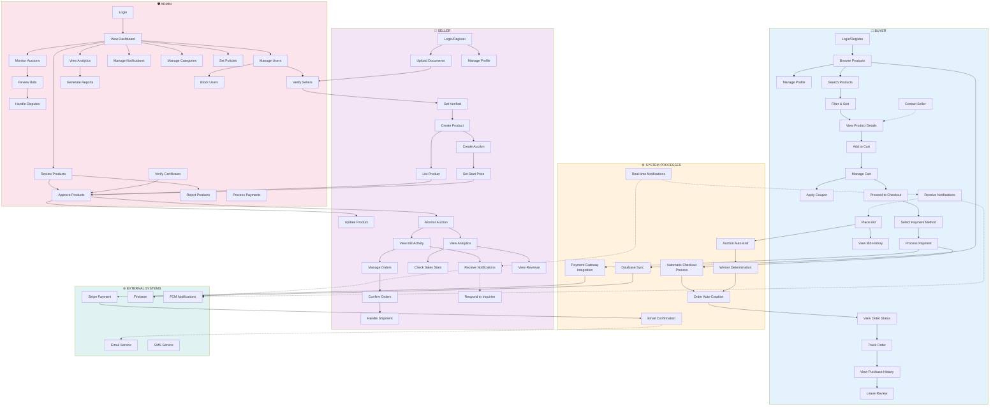
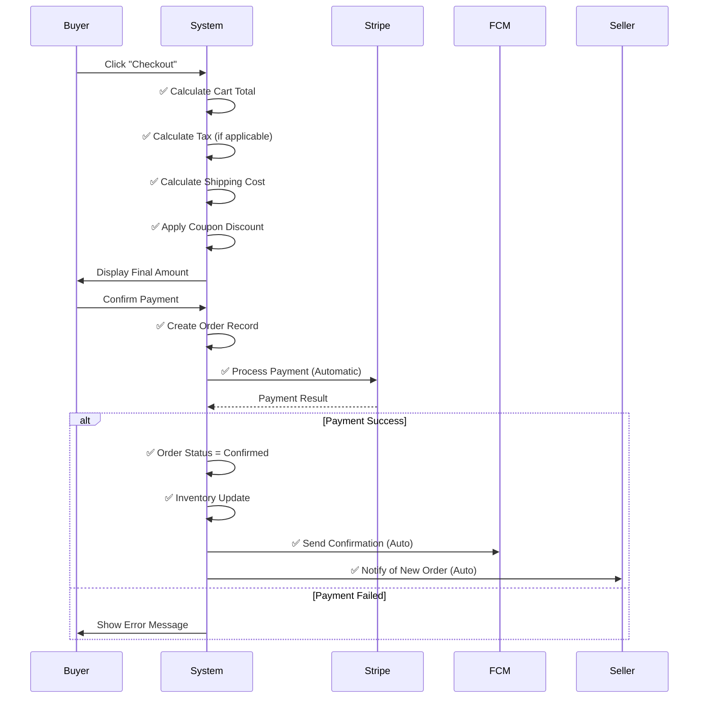
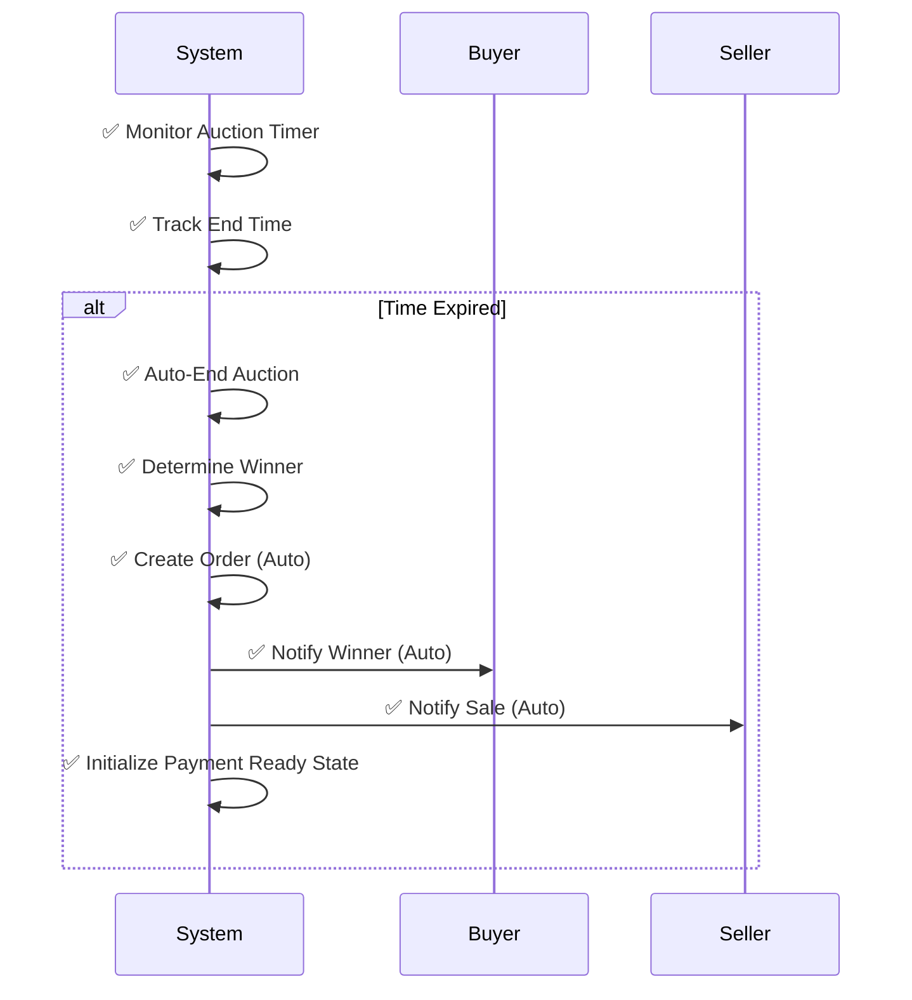
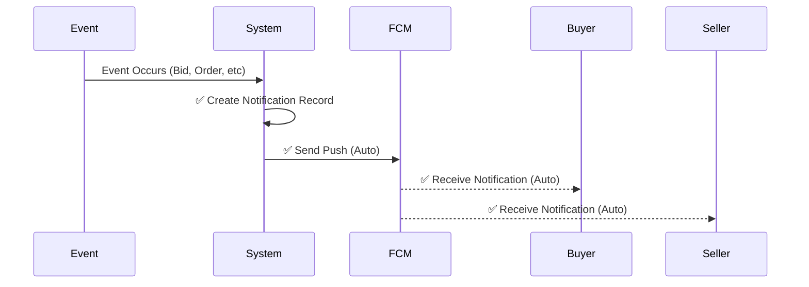

# GemNest - Complete Use Case Diagram

## 📊 System Use Cases - All Actors



---

## 📝 Detailed Use Case Descriptions

### 🛍️ BUYER USE CASES

| Use Case | Description | System Auto-Actions |
|----------|-------------|-------------------|
| **B1: Browse Products** | Search & explore product catalog | Database queries |
| **B2: View Product Details** | Display full product info, certificates, reviews | Load seller info, ratings |
| **B3: Add to Cart** | Add items to shopping cart | Update cart total, stock check |
| **B4: Manage Cart** | Modify quantities, remove items | Recalculate totals |
| **B5: Apply Coupon** | Enter valid coupon code | Validate code, apply discount |
| **B6: Place Bid** | Enter bid amount in auction | Validate bid amount, update UI |
| **B7: View Bid History** | See all bids on auction | Real-time bid updates |
| **B8: Contact Seller** | Call or WhatsApp seller | Open dial/WhatsApp app |
| **B9: Proceed to Checkout** | Review order summary | **AUTO: Calculate totals, tax, shipping** |
| **B10: Select Payment Method** | Choose Stripe payment | Validate payment info |
| **B11: Process Payment** | Complete payment transaction | **AUTO: Call Stripe, validate** |
| **B12: View Order Status** | Track order progress | **AUTO: Update status in real-time** |
| **B13: Track Order** | See delivery tracking | **AUTO: Sync with logistics** |
| **B14: Receive Notifications** | Get real-time push alerts | **AUTO: FCM sends push notifications** |
| **B15: View Purchase History** | See past orders | Query from database |
| **B16: Leave Review** | Rate products & sellers | Store in database |
| **B17: Manage Profile** | Update personal info | Validate & store data |
| **B18: Login/Register** | Firebase auth | Firebase authentication |
| **B19: Search Products** | Filter by keyword | Database search query |
| **B20: Filter & Sort** | Sort by price, rating, etc | Apply filter logic |

### 🏪 SELLER USE CASES

| Use Case | Description | System Auto-Actions |
|----------|-------------|-------------------|
| **S1: Login/Register** | Seller account setup | Firebase authentication |
| **S2: Upload Documents** | Submit NIC & business docs | Store in Firebase |
| **S3: Get Verified** | Admin approval status | Admin review process |
| **S4: Create Product** | List new product | Validate product data |
| **S5: List Product** | Publish product | **AUTO: Create product record** |
| **S6: Update Product** | Modify product details | Update database |
| **S7: Create Auction** | Set up auction listing | Validate auction params |
| **S8: Set Start Price** | Define starting bid | Store auction config |
| **S9: Monitor Auction** | Watch real-time bids | **AUTO: Real-time updates** |
| **S10: View Bid Activity** | See all bids placed | Query bid history |
| **S11: Manage Orders** | Handle customer orders | **AUTO: Link to seller** |
| **S12: Confirm Orders** | Approve/ship orders | Update order status |
| **S13: Handle Shipment** | Track delivery | **AUTO: Update tracking** |
| **S14: View Analytics** | Dashboard with metrics | Query sales data |
| **S15: Check Sales Stats** | Revenue & performance | Aggregate data |
| **S16: Receive Notifications** | Real-time alerts | **AUTO: FCM notifications** |
| **S17: Manage Profile** | Update seller info | Store profile data |
| **S18: View Revenue** | Check earnings | Calculate from payments |
| **S19: Respond to Inquiries** | Answer buyer questions | Send messages |

### 🛡️ ADMIN USE CASES

| Use Case | Description | System Auto-Actions |
|----------|-------------|-------------------|
| **A1: Login** | Admin authentication | Firebase admin auth |
| **A2: View Dashboard** | Overview of all metrics | Aggregate system data |
| **A3: Manage Users** | View/edit user accounts | Query user database |
| **A4: Verify Sellers** | Review seller documents | Approve/reject sellers |
| **A5: Review Products** | Check product listings | Flag suspicious items |
| **A6: Approve Products** | Publish/reject products | Update approval status |
| **A7: Reject Products** | Remove inappropriate items | Update database |
| **A8: Monitor Auctions** | Track active auctions | Real-time queries |
| **A9: Review Bids** | Check bid integrity | Validate bid amounts |
| **A10: Process Payments** | Handle payment disputes | Manual review |
| **A11: Handle Disputes** | Resolve conflicts | Refund/mediate |
| **A12: View Analytics** | System-wide statistics | Query aggregated data |
| **A13: Generate Reports** | Create business reports | Export data |
| **A14: Manage Notifications** | Configure notification rules | Update notification settings |
| **A15: Block Users** | Deactivate accounts | Flag in database |
| **A16: Verify Certificates** | Authenticate gem certs | Store verification status |
| **A17: Manage Categories** | Create/edit categories | Update category list |
| **A18: Set Policies** | Configure system rules | Store in config |

---

## ⚙️ CRITICAL SYSTEM AUTOMATIC PROCESSES (Not Manual!)

### 🔄 Checkout Process - **AUTOMATIC**


### 🎯 Auction Auto-Completion - **AUTOMATIC**


### 📬 Notification System - **AUTOMATIC**


---

## 🔗 Complete Use Case Relationships & Dependencies

### 📌 EXTENDS (Optional Extensions)

**EXTENDS** relationships describe optional features that can enhance a base use case.

#### Buyer Extends
| Base Use Case | Extends | Description |
|---------------|---------|-------------|
| B9: Proceed to Checkout | **→ B5: Apply Coupon** | Buyer may optionally apply coupon code during checkout |
| B2: View Product Details | **→ B8: Contact Seller** | During product view, buyer may optionally contact seller |
| B1: Browse Products | **→ B20: Filter & Sort** | Browsing may be extended with filtering and sorting options |
| B15: View Purchase History | **→ B16: Leave Review** | After viewing history, buyer may extend by leaving reviews |
| B6: Place Bid | **→ B7: View Bid History** | Placing a bid may include viewing complete bid history |
| B12: View Order Status | **→ B13: Track Order** | Order status viewing may be extended with detailed tracking |

#### Seller Extends
| Base Use Case | Extends | Description |
|---------------|---------|-------------|
| S9: Monitor Auction | **→ S10: View Bid Activity** | Monitoring auction extends to viewing detailed bid activity |
| S4: Create Product | **→ S6: Update Product** | Creating product may extend to updating product details |
| S14: View Analytics | **→ S15: Check Sales Stats** | Analytics may be extended with detailed sales statistics |
| S11: Manage Orders | **→ S13: Handle Shipment** | Managing orders extends to handling shipment details |
| S1: Login/Register | **→ S17: Manage Profile** | After login, seller may extend by managing profile |

#### Admin Extends
| Base Use Case | Extends | Description |
|---------------|---------|-------------|
| A8: Monitor Auctions | **→ A9: Review Bids** | Auction monitoring extends to reviewing individual bids |
| A3: Manage Users | **→ A15: Block Users** | User management may extend to blocking/deactivating users |
| A5: Review Products | **→ A7: Reject Products** | Product review extends to rejecting unsuitable products |
| A12: View Analytics | **→ A13: Generate Reports** | Analytics viewing may extend to generating detailed reports |
| A2: View Dashboard | **→ A14: Manage Notifications** | Dashboard access extends to notification management |

---

### 🔄 INCLUDES (Mandatory Sub-processes)

**INCLUDES** relationships describe mandatory sub-processes that must occur when the primary use case is executed. These are automatic and required.

#### Buyer Includes
| Use Case | Includes | Description | Auto-Execute |
|----------|----------|-------------|--------------|
| **B9: Proceed to Checkout** | **→ SYS1: Automatic Checkout Process** | Checkout automatically triggers checkout calculations | ✅ AUTO |
| **B9: Proceed to Checkout** | **→ SYS1 → SYS6: Order Auto-Creation** | Checkout process automatically creates order record | ✅ AUTO |
| **B10: Select Payment Method** | **→ B11: Process Payment** | Selecting payment method requires payment processing | ✅ Required |
| **B11: Process Payment** | **→ SYS2: Payment Gateway Integration** | Payment processing includes Stripe integration | ✅ AUTO |
| **B11: Process Payment** | **→ SYS2 → EXT1: Stripe Payment** | Payment includes actual Stripe API call | ✅ AUTO |
| **B11: Process Payment** | **→ SYS8: Email Confirmation** | Payment includes automatic email confirmation | ✅ AUTO |
| **B6: Place Bid** | **→ SYS3: Real-time Notifications** | Bidding automatically triggers notification system | ✅ AUTO |
| **B6: Place Bid** | **→ SYS4: Auction Auto-End** | Bid placement includes monitoring for auction end | ✅ AUTO |
| **B1: Browse Products** | **→ SYS7: Database Sync** | Product browsing includes real-time database synchronization | ✅ AUTO |
| **B14: Receive Notifications** | **→ EXT3: FCM Notifications** | Notifications include FCM push delivery | ✅ AUTO |

#### Seller Includes
| Use Case | Includes | Description | Auto-Execute |
|----------|----------|-------------|--------------|
| **S5: List Product** | **→ A6: Approve Products** | Product listing includes admin approval requirement | ✅ Required |
| **S8: Set Start Price** | **→ A6: Approve Products** | Starting price setting requires product approval | ✅ Required |
| **S7: Create Auction** | **→ A6: Approve Products** | Auction creation includes product approval process | ✅ Required |
| **S3: Get Verified** | **→ A4: Verify Sellers** | Seller verification includes admin verification process | ✅ Required |
| **S2: Upload Documents** | **→ A4: Verify Sellers** | Document upload includes admin review and verification | ✅ Required |
| **S9: Monitor Auction** | **→ SYS3: Real-time Notifications** | Auction monitoring includes real-time notification updates | ✅ AUTO |
| **S11: Manage Orders** | **→ SYS7: Database Sync** | Order management includes real-time database synchronization | ✅ AUTO |
| **S16: Receive Notifications** | **→ EXT3: FCM Notifications** | Notifications include FCM push delivery to seller | ✅ AUTO |

#### Admin Includes
| Use Case | Includes | Description | Auto-Execute |
|----------|----------|-------------|--------------|
| **A6: Approve Products** | **→ A16: Verify Certificates** | Product approval includes certificate verification | ✅ Required |
| **A4: Verify Sellers** | **→ A5: Review Products** | Seller verification may include product review | ⚠️ Optional |
| **A2: View Dashboard** | **→ A12: View Analytics** | Dashboard includes analytics display | ✅ AUTO |
| **A11: Handle Disputes** | **→ A10: Process Payments** | Dispute handling may include payment processing | ⚠️ Optional |
| **A8: Monitor Auctions** | **→ SYS7: Database Sync** | Auction monitoring includes real-time database sync | ✅ AUTO |

#### System Process Includes
| Use Case | Includes | Description | Auto-Execute |
|----------|----------|-------------|--------------|
| **SYS1: Automatic Checkout Process** | **→ SYS6: Order Auto-Creation** | Checkout automatically creates order record | ✅ AUTO |
| **SYS1: Automatic Checkout Process** | **→ SYS7: Database Sync** | Checkout syncs all data to database | ✅ AUTO |
| **SYS4: Auction Auto-End** | **→ SYS5: Winner Determination** | Auction ending automatically determines winner | ✅ AUTO |
| **SYS5: Winner Determination** | **→ SYS6: Order Auto-Creation** | Winner determination creates order automatically | ✅ AUTO |
| **SYS6: Order Auto-Creation** | **→ SYS3: Real-time Notifications** | Order creation automatically sends notifications | ✅ AUTO |
| **SYS2: Payment Gateway Integration** | **→ EXT1: Stripe Payment** | Payment integration includes Stripe API call | ✅ AUTO |
| **SYS2: Payment Gateway Integration** | **→ SYS8: Email Confirmation** | Payment includes email confirmation trigger | ✅ AUTO |

---

### 🔗 COMPLETE DEPENDENCY CHAIN

#### Complete Buyer Purchase Flow (All Includes)
```
B1: Browse Products
  └─ includes SYS7: Database Sync
  └─ extends B20: Filter & Sort
  └─ extends B19: Search Products
    
B2: View Product Details
  └─ extends B8: Contact Seller
  
B3: Add to Cart
  └─ precondition: B2 (must view first)
  
B4: Manage Cart
  └─ includes B3: Add to Cart
  └─ extends B5: Apply Coupon
  
B9: Proceed to Checkout
  └─ precondition: B3 or B4 (cart needed)
  └─ includes SYS1: Automatic Checkout Process
    └─ includes SYS6: Order Auto-Creation
      └─ includes SYS3: Real-time Notifications
      └─ includes SYS7: Database Sync
  └─ extends B5: Apply Coupon
  
B10: Select Payment Method
  └─ precondition: B9 (checkout first)
  
B11: Process Payment
  └─ precondition: B10 (must select method)
  └─ includes SYS2: Payment Gateway Integration
    └─ includes EXT1: Stripe Payment
    └─ includes SYS8: Email Confirmation
  
B12: View Order Status
  └─ precondition: B11 (payment first)
  └─ extends B13: Track Order
  
B14: Receive Notifications
  └─ triggered by: SYS3, SYS6
  └─ includes EXT3: FCM Notifications
```

#### Complete Seller Product Listing Flow (All Includes)
```
S1: Login/Register
  └─ extends S17: Manage Profile
  
S2: Upload Documents
  └─ includes A4: Verify Sellers
    └─ triggered by: Admin review
  
S3: Get Verified
  └─ precondition: S2 (documents required)
  └─ triggered by: A4 (Admin verification)
  
S4: Create Product
  └─ precondition: S3 (seller verified)
  
S5: List Product
  └─ includes A6: Approve Products
    └─ includes A16: Verify Certificates
  
S6: Update Product
  └─ extends S5: List Product
  
S7: Create Auction
  └─ precondition: S3 (verified seller)
  └─ includes A6: Approve Products
  
S8: Set Start Price
  └─ precondition: S7 (auction created)
  └─ includes A6: Approve Products
  
S9: Monitor Auction
  └─ includes SYS3: Real-time Notifications
  └─ includes SYS7: Database Sync
  └─ extends S10: View Bid Activity
  
S11: Manage Orders
  └─ includes SYS7: Database Sync
  └─ includes SYS3: Real-time Notifications
  └─ extends S13: Handle Shipment
```

#### Complete Admin Approval Flow (All Includes)
```
A1: Login
  └─ precondition: Admin credentials
  
A2: View Dashboard
  └─ includes A12: View Analytics
  └─ extends A14: Manage Notifications
  
A3: Manage Users
  └─ extends A15: Block Users
  
A4: Verify Sellers
  └─ triggered by: S2 (Document upload)
  └─ includes A5: Review Products
  
A5: Review Products
  └─ extends A7: Reject Products
  
A6: Approve Products
  └─ includes A16: Verify Certificates
  └─ precondition: A5 (review first)
  
A8: Monitor Auctions
  └─ includes SYS7: Database Sync
  └─ extends A9: Review Bids
  
A11: Handle Disputes
  └─ may include A10: Process Payments
```

---

### ⚠️ PRECONDITIONS & TRIGGERS

#### Actor Preconditions
| Actor | Precondition | Description |
|-------|--------------|-------------|
| **Buyer** | B18: Login/Register | Must authenticate before any other use case |
| **Seller** | S1: Login/Register | Must authenticate before any seller operations |
| **Seller** | S3: Get Verified | Must be verified before S4, S7 operations |
| **Admin** | A1: Login | Must authenticate with admin credentials |

#### Use Case Preconditions
| Use Case | Requires | Description |
|----------|----------|-------------|
| **B3: Add to Cart** | B2 | Must view product details first |
| **B4: Manage Cart** | B3 | Must add to cart first |
| **B9: Checkout** | B3 ∨ B4 | Cart must have items |
| **B10: Payment Method** | B9 | Must proceed to checkout |
| **B11: Process Payment** | B10 | Must select payment method |
| **B12: Order Status** | B11 | Must complete payment |
| **B13: Track Order** | B12 | Must view order status |
| **S4: Create Product** | S3 | Seller must be verified |
| **S5: List Product** | S4 | Product must be created |
| **S7: Create Auction** | S3 | Seller must be verified |
| **S8: Start Price** | S7 | Auction must be created |
| **S9: Monitor Auction** | S8 | Start price must be set |
| **S11: Manage Orders** | S9 ∨ B11 | Order must exist (from auction or purchase) |
| **S12: Confirm Order** | S11 | Must be managing orders |
| **S13: Handle Shipment** | S12 | Order must be confirmed |
| **A6: Approve Products** | A5 | Must review product first |
| **A11: Handle Disputes** | (ad-hoc) | Triggered by system events |

#### Event Triggers
| Event | Triggered By | Result |
|-------|--------------|--------|
| **SYS3: Notifications** | B6, S9, SYS6 | → B14, S16 receive notifications |
| **SYS4: Auction Auto-End** | System timer | → SYS5 (Winner Determination) |
| **SYS5: Winner Determination** | SYS4 | → SYS6 (Order Auto-Creation) |
| **SYS6: Order Auto-Creation** | B11 ∨ SYS5 | → SYS3 (Notifications), SYS7 (Sync) |
| **A4: Verify Sellers** | S2 (Document upload) | → S3 (Get Verified) |
| **A6: Approve Products** | S5 ∨ S8 (List/Auction) | → S9 (Monitor Auction) |

---

### 🎯 Complete Use Case Matrix

```
┌─────────────────────────────────────────────────────────────────────────────┐
│                    USE CASE RELATIONSHIP MATRIX                              │
├─────┬──────────────────────┬──────────────────┬──────────────────┬──────────┤
│ ID  │ USE CASE             │ INCLUDES         │ EXTENDS          │ REQUIRES │
├─────┼──────────────────────┼──────────────────┼──────────────────┼──────────┤
│ B1  │ Browse Products      │ SYS7             │ B19, B20         │ B18      │
│ B2  │ View Details         │ -                │ B8               │ B1       │
│ B3  │ Add to Cart          │ -                │ -                │ B2       │
│ B4  │ Manage Cart          │ -                │ B5               │ B3       │
│ B5  │ Apply Coupon         │ -                │ -                │ B4       │
│ B6  │ Place Bid            │ SYS3, SYS4       │ B7               │ B1       │
│ B7  │ View Bid History     │ -                │ -                │ B6       │
│ B8  │ Contact Seller       │ -                │ -                │ B2       │
│ B9  │ Proceed Checkout     │ SYS1, SYS6, SYS7 │ B5               │ B4       │
│ B10 │ Select Payment       │ B11              │ -                │ B9       │
│ B11 │ Process Payment      │ SYS2, EXT1, SYS8 │ -                │ B10      │
│ B12 │ View Order Status    │ SYS7             │ B13              │ B11      │
│ B13 │ Track Order          │ SYS7             │ -                │ B12      │
│ B14 │ Receive Notif        │ EXT3             │ -                │ *        │
│ B15 │ View History         │ -                │ B16              │ B1       │
│ B16 │ Leave Review         │ -                │ -                │ B15      │
│ B17 │ Manage Profile       │ -                │ -                │ B18      │
│ B18 │ Login/Register       │ -                │ -                │ *        │
│ B19 │ Search Products      │ -                │ -                │ B1       │
│ B20 │ Filter & Sort        │ -                │ -                │ B1       │
├─────┼──────────────────────┼──────────────────┼──────────────────┼──────────┤
│ S1  │ Login/Register       │ -                │ S17              │ *        │
│ S2  │ Upload Documents     │ A4               │ -                │ S1       │
│ S3  │ Get Verified         │ A4               │ -                │ S2       │
│ S4  │ Create Product       │ -                │ S6               │ S3       │
│ S5  │ List Product         │ A6, A16          │ -                │ S4       │
│ S6  │ Update Product       │ -                │ -                │ S5       │
│ S7  │ Create Auction       │ A6, A16          │ -                │ S3       │
│ S8  │ Set Start Price      │ A6, A16          │ -                │ S7       │
│ S9  │ Monitor Auction      │ SYS3, SYS7       │ S10              │ S8       │
│ S10 │ View Bid Activity    │ -                │ -                │ S9       │
│ S11 │ Manage Orders        │ SYS7, SYS3       │ S13              │ S9│B11   │
│ S12 │ Confirm Orders       │ -                │ -                │ S11      │
│ S13 │ Handle Shipment      │ SYS7             │ -                │ S12      │
│ S14 │ View Analytics       │ SYS7             │ S15              │ S1       │
│ S15 │ Check Sales Stats    │ -                │ -                │ S14      │
│ S16 │ Receive Notif        │ EXT3             │ -                │ *        │
│ S17 │ Manage Profile       │ -                │ -                │ S1       │
│ S18 │ View Revenue         │ -                │ -                │ S14      │
│ S19 │ Respond Inquiries    │ -                │ -                │ S1       │
├─────┼──────────────────────┼──────────────────┼──────────────────┼──────────┤
│ A1  │ Login                │ -                │ -                │ *        │
│ A2  │ View Dashboard       │ A12              │ A14              │ A1       │
│ A3  │ Manage Users         │ -                │ A15              │ A2       │
│ A4  │ Verify Sellers       │ A5               │ -                │ A2       │
│ A5  │ Review Products      │ -                │ A7               │ A2       │
│ A6  │ Approve Products     │ A16              │ -                │ A5       │
│ A7  │ Reject Products      │ -                │ -                │ A5       │
│ A8  │ Monitor Auctions     │ SYS7             │ A9               │ A2       │
│ A9  │ Review Bids          │ -                │ -                │ A8       │
│ A10 │ Process Payments     │ -                │ -                │ A2       │
│ A11 │ Handle Disputes      │ -                │ -                │ A2       │
│ A12 │ View Analytics       │ SYS7             │ A13              │ A2       │
│ A13 │ Generate Reports     │ -                │ -                │ A12      │
│ A14 │ Manage Notifications │ -                │ -                │ A2       │
│ A15 │ Block Users          │ -                │ -                │ A3       │
│ A16 │ Verify Certificates  │ -                │ -                │ A5       │
│ A17 │ Manage Categories    │ -                │ -                │ A2       │
│ A18 │ Set Policies         │ -                │ -                │ A2       │
└─────┴──────────────────────┴──────────────────┴──────────────────┴──────────┘

Legend:
  INCLUDES: Mandatory sub-processes that must execute (often automatic)
  EXTENDS: Optional features that can enhance the base use case
  REQUIRES: Precondition - what must happen before this use case
  *: No specific precondition (can occur any time after authentication)
  │: OR operator
```

---

### 📊 Relationship Statistics

| Metric | Count |
|--------|-------|
| **Total Use Cases** | 57 (20 Buyer + 19 Seller + 18 Admin) |
| **EXTENDS Relationships** | 24 |
| **INCLUDES Relationships** | 45 |
| **REQUIRES Relationships** | 53 |
| **Total Relationships** | 122 |
| **Automatic (System) Processes** | 8 |
| **External System Integrations** | 5 |

---

## 🚫 Common Mistakes in Previous Diagram

### ❌ Issues Fixed:
1. **Checkout was manual** → Now **AUTOMATIC** system process
2. **Missing automatic processes** → Added all system auto-actions
3. **No notification flows** → Added real-time notification system
4. **Incomplete seller flow** → Added analytics, revenue, shipment tracking
5. **Missing admin functions** → Added verification, dispute handling, monitoring
6. **No auction auto-end** → Added automatic auction completion
7. **Payment unclear** → Clearly marked as automatic Stripe processing
8. **No order creation** → Added auto-order creation after payment
9. **Missing winner notification** → Added automatic winner notification
10. **Incomplete buyer profile** → Added all essential buyer use cases

---

## 🎯 Use Case Priority Matrix

### High Priority (Must Have)
- ✅ Browse Products
- ✅ Place Bid
- ✅ Checkout (Auto)
- ✅ Payment Processing (Auto)
- ✅ Seller Verification
- ✅ Product Approval
- ✅ Real-time Notifications (Auto)

### Medium Priority (Important)
- ✅ Order Tracking
- ✅ Analytics Dashboard
- ✅ Auction Monitoring
- ✅ Dispute Handling
- ✅ Product Reviews

### Low Priority (Nice to Have)
- ✅ Advanced Search Filters
- ✅ Wishlist Management
- ✅ Custom Reports

---

## 📊 Actor Interaction Map

```
Buyer ←→ System ←→ Seller
  ↓        ↓        ↓
Admin ←→ Database ←→ Firebase
  ↓        ↓        ↓
Stripe ←→ FCM ←→ Email Service
```

---

## ✅ Validation Checklist

- [x] All buyer use cases covered
- [x] All seller use cases covered
- [x] All admin use cases covered
- [x] Automatic processes clearly marked
- [x] System interactions documented
- [x] External systems included
- [x] Notifications included
- [x] Payment flow automated
- [x] Auction flow automated
- [x] Relationships properly defined
