# GemNest - Complete Use Case Diagram

## Overview
This document contains the complete and corrected use case diagram for the GemNest Mobile App system with all three actors: **Buyer**, **Seller**, and **Admin**.

---

## Complete Use Case Diagram (UML Standard Style - Vertical)

```mermaid
graph LR
    %% ACTORS
    Buyer["👤<br/>BUYER"]
    Seller["🏪<br/>SELLER"]
    Admin["👨‍💼<br/>ADMIN"]

    %% SYSTEM BOUNDARY
    subgraph System["🔲 GemNest E-Commerce System"]
        
        %% Authentication & Account Management
        subgraph Auth["AUTHENTICATION & ACCOUNT"]
            Register[("Register")]
            Login[("Login")]
            Logout[("Logout")]
            UpdateProfile[("Update Profile")]
            ViewAccount[("View Account")]
            ResetPassword[("Reset Password")]
            TwoFactorAuth[("Enable 2FA")]
            UpdatePaymentInfo[("Update Payment")]
        end

        %% Buyer Use Cases
        subgraph BuyerUC["👤 BUYER USE CASES"]
            BrowseProducts[("Browse Products")]
            BrowseAuctions[("Browse Auctions")]
            SearchFilter[("Search & Filter")]
            ViewProductDetails[("View Details")]
            ViewAuctionDetails[("Auction Details")]
            AddToCart[("Add to Cart")]
            RemoveFromCart[("Remove from Cart")]
            ViewCart[("View Cart")]
            ManageFavorites[("Manage Favorites")]
            PlaceBid[("Place Bid")]
            ViewBidHistory[("View Bid History")]
            DirectCheckout[("Direct Checkout")]
            AuctionCheckout[("Auction Checkout")]
            TrackOrder[("Track Order")]
            ViewOrders[("View Orders")]
            LeaveReview[("Leave Review")]
            ViewReviews[("View Reviews")]
            ViewChat[("Chat with Seller")]
            ViewNotifications[("View Notifications")]
        end

        %% Seller Use Cases
        subgraph SellerUC["🏪 SELLER USE CASES"]
            CreateProduct[("Create Product")]
            EditProduct[("Edit Product")]
            DeleteProduct[("Delete Product")]
            UploadCertificate[("Upload Certificate")]
            SetProductPrice[("Set Price")]
            ManageInventory[("Manage Inventory")]
            CreateAuction[("Create Auction")]
            EditAuction[("Edit Auction")]
            SetAuctionPrice[("Set Auction Price")]
            SetAuctionDuration[("Set Duration")]
            MonitorBids[("Monitor Bids")]
            EndAuction[("End Auction")]
            ViewWinner[("View Winner")]
            SellerViewOrders[("View Orders")]
            UpdateOrderStatus[("Update Status")]
            ManageShipping[("Manage Shipping")]
            ViewAnalytics[("View Analytics")]
            ViewRevenue[("View Revenue")]
            ViewRatings[("View Ratings")]
            SellerViewChat[("Chat Buyers")]
            RespondQuestions[("Respond")]
            ManagePromotions[("Manage Promotions")]
        end

        %% Admin Use Cases
        subgraph AdminUC["👨‍💼 ADMIN USE CASES"]
            ViewAllUsers[("View All Users")]
            ViewAllSellers[("View All Sellers")]
            ViewAllBuyers[("View All Buyers")]
            VerifySeller[("Verify Seller")]
            ApproveSellerDocs[("Approve Docs")]
            RejectSellerDocs[("Reject Docs")]
            SuspendSeller[("Suspend Seller")]
            BanUser[("Ban User")]
            UnbanUser[("Unban User")]
            ApproveProduct[("Approve Product")]
            RejectProduct[("Reject Product")]
            ReviewCompliance[("Review Compliance")]
            RemoveProduct[("Remove Product")]
            ApproveAuction[("Approve Auction")]
            RejectAuction[("Reject Auction")]
            ReviewAuctionDetails[("Review Auction")]
            ResolveDisputes[("Resolve Disputes")]
            ResolveRefunds[("Process Refunds")]
            HandleComplaints[("Handle Complaints")]
            ViewSystemAnalytics[("System Analytics")]
            GenerateReports[("Generate Reports")]
            ViewTransactions[("View Transactions")]
            ViewPayments[("View Payments")]
            ManageContent[("Manage Content")]
            SendAnnouncements[("Send Announcements")]
            ManageUsers[("Manage Users")]
            UploadCertTypes[("Certificate Types")]
        end

        %% System Processes
        subgraph SysProc["💻 SYSTEM PROCESSES (Automatic)"]
            AutoCheckout[("Calculate Totals")]
            AutoTax[("Calculate Tax")]
            AutoShipping[("Calculate Shipping")]
            AutoPayment[("Process Payment")]
            AutoInventory[("Update Inventory")]
            AutoNotifyBuyer[("Notify Buyer")]
            AutoNotifySeller[("Notify Seller")]
            AutoAuctionEnd[("End Auction")]
            AutoWinner[("Determine Winner")]
            AutoOrderCreate[("Create Order")]
            AutoEmail[("Send Email")]
        end
    end

    %% BUYER CONNECTIONS
    Buyer --> Register
    Buyer --> Login
    Buyer --> UpdateProfile
    Buyer --> UpdatePaymentInfo
    Buyer --> ViewAccount
    Buyer --> BrowseProducts
    Buyer --> BrowseAuctions
    Buyer --> SearchFilter
    Buyer --> ViewProductDetails
    Buyer --> ViewAuctionDetails
    Buyer --> AddToCart
    Buyer --> RemoveFromCart
    Buyer --> ViewCart
    Buyer --> ManageFavorites
    Buyer --> PlaceBid
    Buyer --> ViewBidHistory
    Buyer --> DirectCheckout
    Buyer --> AuctionCheckout
    Buyer --> TrackOrder
    Buyer --> ViewOrders
    Buyer --> LeaveReview
    Buyer --> ViewReviews
    Buyer --> ViewChat
    Buyer --> ViewNotifications
    Buyer --> Logout

    %% SELLER CONNECTIONS
    Seller --> Register
    Seller --> Login
    Seller --> UpdateProfile
    Seller --> ViewAccount
    Seller --> TwoFactorAuth
    Seller --> CreateProduct
    Seller --> EditProduct
    Seller --> DeleteProduct
    Seller --> UploadCertificate
    Seller --> SetProductPrice
    Seller --> ManageInventory
    Seller --> CreateAuction
    Seller --> EditAuction
    Seller --> SetAuctionPrice
    Seller --> SetAuctionDuration
    Seller --> MonitorBids
    Seller --> EndAuction
    Seller --> ViewWinner
    Seller --> SellerViewOrders
    Seller --> UpdateOrderStatus
    Seller --> ManageShipping
    Seller --> ViewAnalytics
    Seller --> ViewRevenue
    Seller --> ViewRatings
    Seller --> SellerViewChat
    Seller --> RespondQuestions
    Seller --> ManagePromotions
    Seller --> Logout

    %% ADMIN CONNECTIONS
    Admin --> Login
    Admin --> ViewAllUsers
    Admin --> ViewAllSellers
    Admin --> ViewAllBuyers
    Admin --> VerifySeller
    Admin --> ApproveSellerDocs
    Admin --> RejectSellerDocs
    Admin --> SuspendSeller
    Admin --> BanUser
    Admin --> UnbanUser
    Admin --> ApproveProduct
    Admin --> RejectProduct
    Admin --> ReviewCompliance
    Admin --> RemoveProduct
    Admin --> ApproveAuction
    Admin --> RejectAuction
    Admin --> ReviewAuctionDetails
    Admin --> ResolveDisputes
    Admin --> ResolveRefunds
    Admin --> HandleComplaints
    Admin --> ViewSystemAnalytics
    Admin --> GenerateReports
    Admin --> ViewTransactions
    Admin --> ViewPayments
    Admin --> ManageContent
    Admin --> SendAnnouncements
    Admin --> ManageUsers
    Admin --> UploadCertTypes
    Admin --> Logout

    %% INCLUDE RELATIONSHIPS (System Processes)
    DirectCheckout -.->|includes| AutoCheckout
    DirectCheckout -.->|includes| AutoTax
    DirectCheckout -.->|includes| AutoShipping
    DirectCheckout -.->|includes| AutoPayment
    DirectCheckout -.->|includes| AutoInventory
    DirectCheckout -.->|includes| AutoNotifyBuyer
    DirectCheckout -.->|includes| AutoNotifySeller
    DirectCheckout -.->|includes| AutoOrderCreate
    DirectCheckout -.->|includes| AutoEmail

    AuctionCheckout -.->|includes| AutoCheckout
    AuctionCheckout -.->|includes| AutoTax
    AuctionCheckout -.->|includes| AutoShipping
    AuctionCheckout -.->|includes| AutoPayment
    AuctionCheckout -.->|includes| AutoInventory
    AuctionCheckout -.->|includes| AutoNotifyBuyer
    AuctionCheckout -.->|includes| AutoNotifySeller
    AuctionCheckout -.->|includes| AutoOrderCreate
    AuctionCheckout -.->|includes| AutoEmail

    CreateAuction -.->|extends| AutoAuctionEnd
    MonitorBids -.->|extends| AutoWinner

    %% STYLES
    style Buyer fill:#e1f5ff,stroke:#01579b,stroke-width:3px,color:#000
    style Seller fill:#f3e5f5,stroke:#4a148c,stroke-width:3px,color:#000
    style Admin fill:#fff3e0,stroke:#e65100,stroke-width:3px,color:#000

    style System fill:#f5f5f5,stroke:#333,stroke-width:2px

    style Auth fill:#fff9c4,stroke:#f57f17,stroke-width:2px
    style BuyerUC fill:#c8e6c9,stroke:#1b5e20,stroke-width:2px
    style SellerUC fill:#e1bee7,stroke:#4a148c,stroke-width:2px
    style AdminUC fill:#ffe0b2,stroke:#e65100,stroke-width:2px
    style SysProc fill:#ffebee,stroke:#d32f2f,stroke-width:2px,stroke-dasharray: 5 5

    style Register fill:#fff,stroke:#f57f17,stroke-width:1.5px
    style Login fill:#fff,stroke:#f57f17,stroke-width:1.5px
    style Logout fill:#fff,stroke:#f57f17,stroke-width:1.5px

    style AutoCheckout fill:#ffebee,stroke:#d32f2f,stroke-width:2px
    style AutoTax fill:#ffebee,stroke:#d32f2f,stroke-width:2px
    style AutoShipping fill:#ffebee,stroke:#d32f2f,stroke-width:2px
    style AutoPayment fill:#ffebee,stroke:#d32f2f,stroke-width:2px
    style AutoInventory fill:#ffebee,stroke:#d32f2f,stroke-width:2px
    style AutoNotifyBuyer fill:#ffebee,stroke:#d32f2f,stroke-width:2px
    style AutoNotifySeller fill:#ffebee,stroke:#d32f2f,stroke-width:2px
    style AutoAuctionEnd fill:#ffebee,stroke:#d32f2f,stroke-width:2px
    style AutoWinner fill:#ffebee,stroke:#d32f2f,stroke-width:2px
    style AutoOrderCreate fill:#ffebee,stroke:#d32f2f,stroke-width:2px
    style AutoEmail fill:#ffebee,stroke:#d32f2f,stroke-width:2px
```

---

## Key Corrections Made

### 1. **Checkout as System Automatic Process** ✅
- **Before**: Checkout was a simple actor action
- **After**: Checkout now includes automatic system processes:
  - Auto-calculate totals, tax, and shipping
  - System processes payments through gateway
  - System updates inventory automatically
  - System creates order records
  - System sends notifications to both parties
  - System sends confirmation emails

### 2. **Separated Direct Purchase from Auction Checkout** ✅
- `DirectCheckout`: Regular product purchase
- `AuctionCheckout`: Winning an auction then checkout
- Both trigger the same automatic system processes

### 3. **Added Missing Use Cases**

#### **Buyer Use Cases Added:**
- ✅ View Bid History
- ✅ Manage Favorites
- ✅ Chat with Seller
- ✅ View Seller Reviews
- ✅ Search & Filter

#### **Seller Use Cases Added:**
- ✅ Monitor Auction Bids
- ✅ View Auction Winner
- ✅ View Order History
- ✅ Create Discount Promotions
- ✅ Respond to Questions
- ✅ Chat with Buyers
- ✅ Upload Gem Certificates

#### **Admin Use Cases Added:**
- ✅ Approve/Reject Seller Documents
- ✅ Resolve Disputes
- ✅ Process Refunds
- ✅ Handle Customer Complaints
- ✅ View All Transactions
- ✅ Upload Certificate Types
- ✅ Send Announcements
- ✅ Manage User Access

### 4. **Automatic System Processes (Highlighted in Red Dashed Box)** 💻
These represent backend processes that happen automatically without direct user action:
- Payment processing
- Order creation
- Inventory updates
- Notifications
- Auction timing & winner determination

---

## Actor Descriptions

### 👤 **BUYER**
- Browse and search products/auctions
- Add items to cart
- Place bids on auctions
- Initiate checkout (system handles rest)
- Track orders
- Rate sellers and leave reviews
- Communicate with sellers
- Manage account and payment methods

### 🏪 **SELLER**
- Create and manage product listings
- Create and manage auctions
- Upload gem certificates and documentation
- Monitor bids and auction activity
- View and update order status
- Track sales and revenue
- Communicate with buyers
- View analytics and performance metrics
- Manage promotions and pricing

### 👨‍💼 **ADMIN**
- Verify and approve seller accounts
- Approve/reject products and auctions
- Review seller documentation
- Resolve disputes and complaints
- Process refunds
- View system-wide analytics
- Manage user access and permissions
- Handle moderation and account suspension
- Generate reports
- Manage content and announcements

---

## Use Case Categories

| Category | Count | Examples |
|----------|-------|----------|
| **Authentication** | 8 | Register, Login, 2FA, Reset Password, etc. |
| **Buyer Use Cases** | 20 | Browse, Search, Bid, Checkout, Track, Review |
| **Seller Use Cases** | 20 | Create Product/Auction, Monitor, Analyze, Chat |
| **Admin Use Cases** | 24 | Verify, Approve, Resolve, Report, Manage |
| **System Auto Processes** | 11 | Payment, Inventory, Notifications, Winner |
| **Total** | **83** | Complete system coverage |

---

## Important Notes

### ✅ **Checkout is System-Driven**
The checkout process is now correctly modeled as:
1. User initiates checkout
2. **System automatically:**
   - Calculates totals, tax, shipping
   - Processes payment
   - Updates inventory
   - Creates order record
   - Sends notifications
   - Sends confirmation email

### ✅ **Auction Automation**
- System automatically ends auctions at scheduled time
- System determines and notifies winner
- Winner can then proceed to checkout (triggering the same automatic processes)

### ✅ **Separated Concerns**
- Authentication flows (shared by all actors)
- Actor-specific use cases (Buyer/Seller/Admin)
- Automatic system processes (shown as dependencies)

---

## Recommendations for Implementation

1. **Use `.includes` relationships** for automatic system processes
2. **Use `.extends` relationships** for optional extensions
3. **Document API endpoints** that trigger each use case
4. **Map database operations** to each use case
5. **Define error handling** for system processes (payment failures, etc.)

---

*This use case diagram provides a complete and accurate representation of the GemNest system with all three actors and their interactions with automatic system processes clearly separated.*
