# GemNest - Complete Use Case Diagram

## 📊 System Use Cases - All Actors


---

## 📝 Detailed Use Case Descriptions

### 🛍️ BUYER USE CASES

| Use Case | Description | System Auto-Actions |
|----------|-------------|-------------------|
| **B1: Browse Products** | Search & explore product catalog | Database queries |
| **B2: View Product Details** | Display full product info, certificates, reviews | Load seller info, ratings |
| **B3: Add to Cart** | Add items to shopping cart | Update cart total, stock check |
| **B4: Manage Cart** | Modify quantities, remove items | Recalculate totals |
| **B5: Apply Coupon** | Enter valid coupon code | Validate code, apply discount |
| **B6: Place Bid** | Enter bid amount in auction | Validate bid amount, update UI |
| **B7: View Bid History** | See all bids on auction | Real-time bid updates |
| **B8: Contact Seller** | Call or WhatsApp seller | Open dial/WhatsApp app |
| **B9: Proceed to Checkout** | Review order summary | **AUTO: Calculate totals, tax, shipping** |
| **B10: Select Payment Method** | Choose Stripe payment | Validate payment info |
| **B11: Process Payment** | Complete payment transaction | **AUTO: Call Stripe, validate** |
| **B12: View Order Status** | Track order progress | **AUTO: Update status in real-time** |
| **B13: Track Order** | See delivery tracking | **AUTO: Sync with logistics** |
| **B14: Receive Notifications** | Get real-time push alerts | **AUTO: FCM sends push notifications** |
| **B15: View Purchase History** | See past orders | Query from database |
| **B16: Leave Review** | Rate products & sellers | Store in database |
| **B17: Manage Profile** | Update personal info | Validate & store data |
| **B18: Login/Register** | Firebase auth | Firebase authentication |
| **B19: Search Products** | Filter by keyword | Database search query |
| **B20: Filter & Sort** | Sort by price, rating, etc | Apply filter logic |

### 🏪 SELLER USE CASES

| Use Case | Description | System Auto-Actions |
|----------|-------------|-------------------|
| **S1: Login/Register** | Seller account setup | Firebase authentication |
| **S2: Upload Documents** | Submit NIC & business docs | Store in Firebase |
| **S3: Get Verified** | Admin approval status | Admin review process |
| **S4: Create Product** | List new product | Validate product data |
| **S5: List Product** | Publish product | **AUTO: Create product record** |
| **S6: Update Product** | Modify product details | Update database |
| **S7: Create Auction** | Set up auction listing | Validate auction params |
| **S8: Set Start Price** | Define starting bid | Store auction config |
| **S9: Monitor Auction** | Watch real-time bids | **AUTO: Real-time updates** |
| **S10: View Bid Activity** | See all bids placed | Query bid history |
| **S11: Manage Orders** | Handle customer orders | **AUTO: Link to seller** |
| **S12: Confirm Orders** | Approve/ship orders | Update order status |
| **S13: Handle Shipment** | Track delivery | **AUTO: Update tracking** |
| **S14: View Analytics** | Dashboard with metrics | Query sales data |
| **S15: Check Sales Stats** | Revenue & performance | Aggregate data |
| **S16: Receive Notifications** | Real-time alerts | **AUTO: FCM notifications** |
| **S17: Manage Profile** | Update seller info | Store profile data |
| **S18: View Revenue** | Check earnings | Calculate from payments |
| **S19: Respond to Inquiries** | Answer buyer questions | Send messages |

### 🛡️ ADMIN USE CASES

| Use Case | Description | System Auto-Actions |
|----------|-------------|-------------------|
| **A1: Login** | Admin authentication | Firebase admin auth |
| **A2: View Dashboard** | Overview of all metrics | Aggregate system data |
| **A3: Manage Users** | View/edit user accounts | Query user database |
| **A4: Verify Sellers** | Review seller documents | Approve/reject sellers |
| **A5: Review Products** | Check product listings | Flag suspicious items |
| **A6: Approve Products** | Publish/reject products | Update approval status |
| **A7: Reject Products** | Remove inappropriate items | Update database |
| **A8: Monitor Auctions** | Track active auctions | Real-time queries |
| **A9: Review Bids** | Check bid integrity | Validate bid amounts |
| **A10: Process Payments** | Handle payment disputes | Manual review |
| **A11: Handle Disputes** | Resolve conflicts | Refund/mediate |
| **A12: View Analytics** | System-wide statistics | Query aggregated data |
| **A13: Generate Reports** | Create business reports | Export data |
| **A14: Manage Notifications** | Configure notification rules | Update notification settings |
| **A15: Block Users** | Deactivate accounts | Flag in database |
| **A16: Verify Certificates** | Authenticate gem certs | Store verification status |
| **A17: Manage Categories** | Create/edit categories | Update category list |
| **A18: Set Policies** | Configure system rules | Store in config |

---

## ⚙️ CRITICAL SYSTEM AUTOMATIC PROCESSES (Not Manual!)

### 🔄 Checkout Process - **AUTOMATIC**

```mermaid
sequenceDiagram
    Buyer->>System: Click "Checkout"
    System->>System: ✅ Calculate Cart Total
    System->>System: ✅ Calculate Tax (if applicable)
    System->>System: ✅ Calculate Shipping Cost
    System->>System: ✅ Apply Coupon Discount
    System->>Buyer: Display Final Amount
    Buyer->>System: Confirm Payment
    System->>System: ✅ Create Order Record
    System->>Stripe: ✅ Process Payment (Automatic)
    Stripe-->>System: Payment Result
    alt Payment Success
        System->>System: ✅ Order Status = Confirmed
        System->>System: ✅ Inventory Update
        System->>FCM: ✅ Send Confirmation (Auto)
        System->>Seller: ✅ Notify of New Order (Auto)
    else Payment Failed
        System->>Buyer: Show Error Message
    end
```


### 🎯 Auction Auto-Completion - **AUTOMATIC**

```mermaid
sequenceDiagram
    System->>System: ✅ Monitor Auction Timer
    System->>System: ✅ Track End Time
    alt Time Expired
        System->>System: ✅ Auto-End Auction
        System->>System: ✅ Determine Winner
        System->>System: ✅ Create Order (Auto)
        System->>Buyer: ✅ Notify Winner (Auto)
        System->>Seller: ✅ Notify Sale (Auto)
        System->>System: ✅ Initialize Payment Ready State
    end
```


### 📬 Notification System - **AUTOMATIC**

```mermaid
sequenceDiagram
    participant Event
    participant System
    participant FCM
    participant Buyer
    participant Seller

    Event->>System: Event Occurs (Bid, Order, etc)
    System->>System: ✅ Create Notification Record
    System->>FCM: ✅ Send Push (Auto)
    FCM-->>Buyer: ✅ Receive Notification (Auto)
    FCM-->>Seller: ✅ Receive Notification (Auto)
```


---

## 🔗 Key Relationships & Inclusions

### Extends (includes optional features)
- B4 **extends** B9 (Apply coupon during checkout)
- S9 **extends** S10 (Monitor includes viewing bids)
- A8 **extends** A9 (Monitor auctions includes reviewing bids)

### Includes (mandatory sub-processes)
- B9 **includes** SYS1 (Checkout includes auto-calculation)
- B11 **includes** SYS2 (Payment processing)
- S8 **includes** A6 (Product must be approved)
- B6 **includes** SYS3 (Bidding triggers notifications)

### Preconditions
- B3 requires B2 (Must view before adding)
- B9 requires B3 or B4 (Cart needed for checkout)
- B11 requires B10 (Must select payment method)
- S4 requires S3 (Seller must be verified)
- S7 requires S3 (Seller must be verified)
- A6 requires A5 (Must review before approval)

---

## 🚫 Common Mistakes in Previous Diagram

### ❌ Issues Fixed:
1. **Checkout was manual** → Now **AUTOMATIC** system process
2. **Missing automatic processes** → Added all system auto-actions
3. **No notification flows** → Added real-time notification system
4. **Incomplete seller flow** → Added analytics, revenue, shipment tracking
5. **Missing admin functions** → Added verification, dispute handling, monitoring
6. **No auction auto-end** → Added automatic auction completion
7. **Payment unclear** → Clearly marked as automatic Stripe processing
8. **No order creation** → Added auto-order creation after payment
9. **Missing winner notification** → Added automatic winner notification
10. **Incomplete buyer profile** → Added all essential buyer use cases

---

## 🎯 Use Case Priority Matrix

### High Priority (Must Have)
- ✅ Browse Products
- ✅ Place Bid
- ✅ Checkout (Auto)
- ✅ Payment Processing (Auto)
- ✅ Seller Verification
- ✅ Product Approval
- ✅ Real-time Notifications (Auto)

### Medium Priority (Important)
- ✅ Order Tracking
- ✅ Analytics Dashboard
- ✅ Auction Monitoring
- ✅ Dispute Handling
- ✅ Product Reviews

### Low Priority (Nice to Have)
- ✅ Advanced Search Filters
- ✅ Wishlist Management
- ✅ Custom Reports

---

## 📊 Actor Interaction Map

```
Buyer ←→ System ←→ Seller
  ↓        ↓        ↓
Admin ←→ Database ←→ Firebase
  ↓        ↓        ↓
Stripe ←→ FCM ←→ Email Service
```

---

## ✅ Validation Checklist

- [x] All buyer use cases covered
- [x] All seller use cases covered
- [x] All admin use cases covered
- [x] Automatic processes clearly marked
- [x] System interactions documented
- [x] External systems included
- [x] Notifications included
- [x] Payment flow automated
- [x] Auction flow automated
- [x] Relationships properly defined
